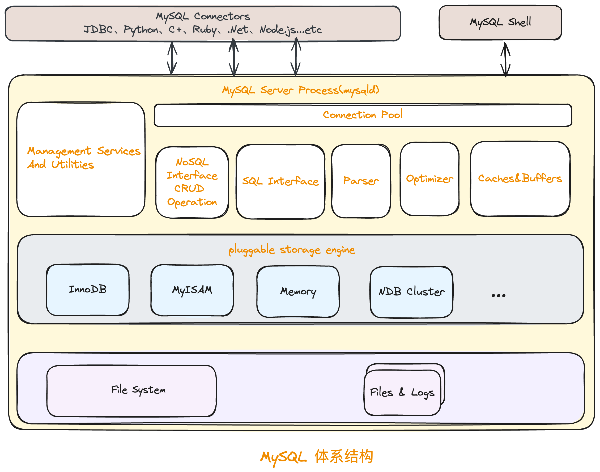

#### 1. 在Docker上安装MySQL

```shell
[root@localhost ~]# docker pull mysql

[root@localhost ~]# docker images

[root@localhost /]# docker run --name mysql8.0 -p 3306:3306 -v /app/mysql:/var/lib/mysql -e MYSQL_ROOT_PASSWORD=root -d mysql:latest

[root@localhost /]# docker ps

```

#### 2. MySQL体系结构

<p align='middle'></p>

* MySQL Connectors: 为客户端程序提供与MySQL Server的连接，本文章主要关注的是[Connector/J](https://dev.mysql.com/doc/connector-j/en/)(为使用标准的JDBC API的Java应用程序提供驱动支持)
* MySQL Shell: MySQL 的高级客户端和代码编辑器。
* Management Services & Utilities: 备份，安全，集群等管理工具。
* Connection Pool: 用于管理用户连接和线程处理，由于MySQL建立连接需要消耗很多时间，连接池会将这些连接进行缓存，这样可以更好的提升服务器的性能。
* SQL Interface: 接受用户的SQL命令，并且返回用户需要查询的结果。比如DML、DDL、存储过程、视图、触发器等
* Parser(解析器): SQL命令传递到解析器，解析器负责将请求的SQL解析生成解析树，包含词法分析和语法分析。词法分析主要是识别字符串分别是什么，代表什么。语法分析主要是根据语法规则，判断输入的SQL语句是否满足MySQL语法规范。
* Optimizer(查询优化器): 解析器生成的“解析树”经过语法校验后，会交由优化器将其转换成执行计划，这个执行计划表明应该使用哪些索引进行查询（全表检索还是使用索引检索），表之间的连接顺序如何，最后会按照执行计划中的步骤调用存储引擎提供的方法来真正的执行查询，并将结果返回给用户。
* Caches & Buffers: 全局缓存等。
* Innodb: 存储引擎，MySQL5.5版本开始默认的存储引擎，对数据进行存储和读取，其将数据存储至磁盘中，具有崩溃恢复的功能，InnoDB Crash Recovery自动完成在崩溃之前提交的更改，并撤消正在进行但未提交的更改。


---

参考资料

[1] [MySQL :: MySQL 8.0 Reference Manual](https://dev.mysql.com/doc/refman/8.0/en/)

[2] Silvia Botros / Jeremy Tinley.高性能Mysql(第四版)[M].电子工业出版社.2022