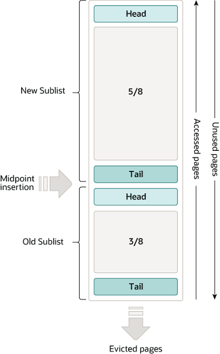

#### 1. MySQL存储引擎

InnoDB、Memory、MyISAM、

#### 2. InnoDB体系结构

MySQL5.5 版本开始，默认使用 InnoDB 存储引擎，它擅长事务处理，具有崩溃恢复特性，下图为InnoDB架构图，左侧为内存架构，右侧为磁盘架构。


<p align='middle'>InnoDB体系结构(来源MySQL8.0官网)</p>

#### 3. ACID Model

- ***A***: atomicity.原子性，主要涉及InnoDB的事务，与此相关的MySQL特性包括：自动提交设置，COMMIT语句，ROLLBACK语句。
- ***C***: consistency.一致性，主要涉及InnoDB的崩溃回复，相关特性是双写缓冲区、崩溃回复。
- ***I***: isolation.隔离性，主要涉及InnoDB的事务，特别是每个事务的隔离级别。
- ***D***: durability.持久化，主要涉及InnoDB双写缓冲区，binlog同步等。

#### 4. In-Memory Structures

内存架构中主要分为：Buffer Poll(内存缓冲池)、Change Buffer、LogBuffer、Adaptive Hash Index四个区。

##### 4.1. Buffer Pool

官网介绍Buffer Pool即缓冲池是InnoDB在访问表和索引数据时缓存的主要区域。在执行增删改查操作时，先操作缓存池中的数据(如果缓存池中没有，则从磁盘加载并进行缓存)，然后以一定的频率刷新到磁盘，这样减少了磁盘IO，加快了处理速度。

###### 4.1.1. Buffer Pool大小设置

```shell
# 查看Buffer Pool Size，单位是字节，134217728字节，等于128M
mysql> show variables like '%innodb_buffer_pool_size%';
+-------------------------+-----------+
| Variable_name           | Value     |
+-------------------------+-----------+
| innodb_buffer_pool_size | 134217728 |
+-------------------------+-----------+
# 使用 set persist innodb_buffer_pool_size=xxx  可以设置大小
# show status like '%buffer_pool_wait%' 如果value值大于0，表示缓存池设置过小
```

```shell
mysql> show engine innodb status
# 省略部分内容
BUFFER POOL AND MEMORY
----------------------
Total large memory allocated 0
Dictionary memory allocated 497456
Buffer pool size   8192 # 表示该Buffer Pool可以容纳多少缓存页，单位是页，每个页大小是16kb
Free buffers       7028 # 表示当前Buffer Pool还有多少空闲缓存页，即free链表中还有多少个节点
Database pages     1164 # 表示LRU链表中的页的数量，包含young和old两个区域的节点数量
Old database pages 449 # 表示LRU链表old区域的节点数量
Modified db pages  0
Pending reads      0
Pending writes: LRU 0, flush list 0, single page 0 # 表示即将从LRU、flush链表和单个页面刷新到磁盘中的页面数量
Pages made young 1, not young 0
0.00 youngs/s, 0.00 non-youngs/s
Pages read 1018, created 146, written 204
0.00 reads/s, 0.00 creates/s, 0.00 writes/s
No buffer pool page gets since the last printout
Pages read ahead 0.00/s, evicted without access 0.00/s, Random read ahead 0.00/s
LRU len: 1164, unzip_LRU len: 0
I/O sum[0]:cur[0], unzip sum[0]:cur[0]
```

###### 4.1.2. Buffer Pool 初始化

Buffer Pool实际占用内存的大小会比innodb_buffer_pool_size的值大一些，这和它的结构相关。MySQL启动时，InnoDB 会为 Buffer Pool 申请一片连续的内存空间，然后按照默认的16KB的大小划分出一个个的页， Buffer Pool 中的页就叫做缓存页。一开始这些页都是空闲的，随着增删改查操作的执行，将会有数据从磁盘中加载到缓存页上。为更好的管理这些缓存页，InnoDB 为每一个缓存页在最前面都创建了一个内存大小一样的控制块。MySQl在数据操作过程中涉及到加锁，为加快处理速度，可以将buffer pool分成多个实例，这样每个instance之间相互不影响，一个instance的结构大致如下：

<p align='middle'></p>

控制块中主要包含缓存页的编号，缓存页所属的表空间，缓存页在buffer pool中的内存地址等。

###### 4.1.3. 管理Buffer Pool

随着MySQL的运行，增删改查操作的进行，Buffer Pool上的缓存页既有被使用的，也有空闲的。为了更快的找到空闲页，Buffer Pool在内存中维护了很多的链表来管理缓存页。有LRU List、Free List、Flush List。

* Free List

  管理空闲页的是Free List，其将空闲页的控制块作为链表的节点，每个控制块包含了缓存页的地址。只要有一个数据页空闲出来之后，直接把该数据页的地址追加到Free链表即可。反之每当需要从磁盘中加载一个页到 Buffer Pool 中时，就从 Free链表中取一个空闲的缓存页，并且把该缓存页对应的控制块的信息填上，然后把该缓存页对应的控制块从 Free 链表中移除。

* LRU List

  LRU算法：链表头部的节点是最近使用的，而链表末尾的节点是最久没被使用的。当空间不够了，就淘汰最久没被使用的节点，从而腾出空间。

  MySQL有一个预读机制，为避免预读失效，降低命中率，MySQL使用了改进后的LRU算法。

  通常数据库的一个Scan操作可能会访问到大量的，甚至超过内存容量的Page数，但这些Page在Scan结束后可能并不会继续被使用，在这个过程中，LRU List被整个替换一遍，导致Scan操作结束后的一段时间内，Buffer Pool的命中率变的很低。为解决这个问题，InnoDB将LRU List分成两段，通过一个Midpoint将整个List分为New Sublist和Old Sublist，每次需要Page换出的时候会从List的尾部选择：

  

  <p align='middle'>LRU示意图(来源于MySQL8.0官网)</p>

* Flush List

  MySQL更新数据，不需要每次都写入磁盘，而是将 Buffer Pool 对应的缓存页标记为脏页，然后再由后台线程将脏页写入到磁盘，这样提高了写的性能。为了能快速知道哪些缓存页是脏的，就设计了 Flush 链表，其链表的节点也是控制块，元素都是脏页。

缓冲池以Page页为单位，底层采用链表数据结构管理Page，根据状态可以将Page分为三种类型。

* free page：空闲Page，未被使用。

- clean page：被使用page，数据没有被修改过。
- dirty page：脏页，被使用page，数据被修改过，其中数据与磁盘上的数据产生了不一致。

##### 4.2. Change Buffer

change buffer是一种特殊的数据结构，只适用于普通索引，而不适用于唯一索引。当需要更新(`NSERT`, `UPDATE`, or `DELETE`)一个数据页时，如果数据页在内存中就直接更新，而如果这个数据页还没有在内存中的话，在不影响数据一致性的前提下，InnoDB 会将这些更新操作缓存在 change buffer 中，这样就不需要从磁盘中读入这个数据页了。在下次查询需要访问这个数据页的时候，将数据页读入内存，然后执行 change buffer 中与这个页有关的操作。

<p align='middle'>Change Buffer示意图(来源于MySQL8.0官网)</p>  

change buffer之所以只适用于普通索引，是因为如果索引设置了唯一（Unique）属性，在进行修改操作时，InnoDB必须进行唯一性检查。这就导致索引页即使不在缓冲池，为校验唯一性磁盘上的页读取无法避免，此时就应该直接把相应的页放入缓冲池再进行修改。综上，change buffer只适用于普通索引。

###### 4.2.1. 设置change buffer大小

```shell
mysql> show variables like '%innodb_change_buffer%';
+-------------------------------+-------+
| Variable_name         | Value |
+-------------------------------+-------+
| innodb_change_buffer_max_size | 25   |
| innodb_change_buffering    | none  |
+-------------------------------+-------+
```

innodb_change_buffer_max_size：配置写缓冲的大小，占整个缓冲池的比例，默认25表示change buffer最大可以占用innodb buffer的25%，最大可设置的值为50%；

innodb_change_buffering：默认none关闭change buffer；还有其他值可以选：all-所有的非唯一普通索引页写入change buffer；none-关闭change buffer；
inserts-缓冲插入操作；deletes-缓冲删除操作；changes-缓冲插入和删除操作；purges-缓冲在后台发生的物理删除操作；

##### 4.3. 自适应Hash索引

InnoDB默认是不支持hash索引的，默认支持的是B+树的索引。因为hash索引不支持范围查找，仅可以用来做值匹配查找。但是自适应hash索引，用于优化对Buffer Pool数据的查询。InnoDB存储引擎会监控对表上各项索引页的查询，如果观察到hash索引可以提升速度，则建立hash索引，称之为自适应hash索引，是内存中的一种数据结构，自适应Hash索引更像是索引的索引，以此来缩短查找的路径，在自适应Hash索引中，key是经常被访问的索引，value是完整记录的位置。

只适用于等值查询，不适用于范围查询和排序的场景。对热点数据，Buffer Pool建立自适应Hash索引，非持久化的。可以通过innodb_adaptive_hash_index来设置开启还是关闭(on/off)。

##### 4.4. Log Buffer

日志缓冲区是保存要写入磁盘上的日志文件的数据的内存区。日志缓冲区大小由Innodb_LOG_BUFFER_SIZE变量定义。默认大小为16MB。日志缓冲区的内容会定期刷新到磁盘。大型日志缓冲区使大型事务能够运行，而无需在事务提交之前将redo log数据写入磁盘。因此，如果有更新、插入或删除许多行的事务，则增加日志缓冲区的大小可以节省磁盘I/O。

**InnoDB有两个非常重要的日志：undo log、redo log**: 通过undo log可以看到数据较早版本，实现MVCC，或回滚事务等功能;通过redo log用来保证事务持久性

事务在执行过程中，生成的 redo log 是要先写到 redo log buffer 中的。

通过 innodb_flush_log_at_trx_commit 参数可以查看刷新到磁盘时机。这里有0,1,2三个值：

- 0：每秒将日志写入并刷新到磁盘一次。
- 1：日志在每次事务提交时写入并刷新到磁盘。
- 2：日志在每次事务提交后写入，并每秒刷新到磁盘一次。

#### 5. On-Disk Structures

##### 5.1. Tablespaces

表空间(Tablespace)：一个mysql实例，即一个数据库实例，可以对应多个表空间(ibd文件)，用于存储记录，索引等数据。

###### 5.1.1. System Tablespace　　

```shell
[root@localhost var]# docker ps
CONTAINER ID   IMAGE          COMMAND                   CREATED       STATUS       PORTS                                                  NAMES
e11ed1cac7b6   mysql:latest   "docker-entrypoint.s…"   13 days ago   Up 13 days   0.0.0.0:3306->3306/tcp, :::3306->3306/tcp, 33060/tcp   mysql8.0
[root@localhost var]# docker exec -it mysql8.0 /bin/bash
bash-5.1# ls
afs  bin  boot	dev  docker-entrypoint-initdb.d  etc  home  lib  lib64	media  mnt  opt  proc  root  run  sbin	srv  sys  tmp  usr  var
bash-5.1# cd var/lib/mysql
bash-5.1# ls
'#ib_16384_0.dblwr'  '#innodb_temp'   binlog.000002   ca.pem	        ib_buffer_pool	 mysql	      mysql_upgrade_history   public_key.pem    sys
'#ib_16384_1.dblwr'   auto.cnf	      binlog.index    client-cert.pem   ibdata1		 mysql.ibd    performance_schema      server-cert.pem   undo_001
'#innodb_redo'	      binlog.000001   ca-key.pem      client-key.pem    ibtmp1		 mysql.sock   private_key.pem	      server-key.pem    undo_002
```

系统表空间默认存储在名为`ibdata1`的文件中。这个文件通常位于MySQL的数据目录下。

###### 5.1.2. File-Per-Table Tablespace

File-Per-Table Tablespace（每个表一个表空间）是MySQL中的一个存储配置选项，它允许每个InnoDB表使用单独的表空间文件来存储数据和索引。使用File-Per-Table Tablespace选项，每个InnoDB表都会有一个独立的表空间文件，位于数据目录下。

File-Per-Table Tablespace的优点包括：

* 管理：每个表有自己的表空间文件，方便管理和维护。可以更方便地备份、恢复或迁移单个表。

- 性能：每个表具有独立的表空间文件，可以在磁盘上更好地分布和组织数据，提高性能和并发访问的能力。
- 存储空间：使用File-Per-Table Tablespace可以更有效地使用存储空间。当有大量小表或经常进行删除和重建表时，每个表的表空间文件可以更好地管理空间，避免系统表空间的不断增长。

File-Per-Table Tablespace的缺点和注意事项包括：

- 管理复杂性：每个表都会有一个独立的表空间文件，这可能增加了管理的复杂性，包括备份和维护的管理操作。
- 存储和文件系统：使用File-Per-Table Tablespace可能涉及更多的磁盘IO操作，并可能增加文件系统的碎片化问题。

使用File-Per-Table Tablespace可以在创建表时进行配置或在现有表上进行更改。要在创建新表时启用File-Per-Table Tablespace，可以在创建表的DDL语句中加上`ENGINE=InnoDB`选项。要在已有表上启用File-Per-Table Tablespace，可以使用MySQL的`ALTER TABLE`语句并设置`innodb_file_per_table`参数为ON。

###### 5.1.3 General Tablespaces

General Tablespaces（通用表空间）是MySQL 5.7版本引入的一个功能，在InnoDB存储引擎中提供了更灵活和更高级的表空间管理选项。 

通用表空间允许将多个InnoDB表存储在一个或多个共享表空间文件中，而不是每个表都有自己的独立表空间文件（如File-Per-Table Tablespace中）。这些共享表空间文件可以在运行时动态添加或删除新的表。

通用表空间的优点包括：

- 简化管理：使用通用表空间可以更方便地管理和维护多个表。可以将相关的表组织在同一个共享表空间中，便于备份、恢复和迁移。
- 空间效率：通用表空间可以更有效地使用存储空间。多个表可以共享一个表空间文件，避免了为每个表都创建单独的表空间文件的开销。
- 高性能：由于多个表共享表空间文件，可以提高磁盘IO操作的效率。此外，共享表空间可以利用预读机制（预读相邻页）来提高查询性能。

 使用通用表空间时，可以在创建表时指定`TABLESPACE`子句来为表分配到指定的共享表空间，也可以使用`ALTER TABLE`语句将现有表移动到共享表空间中。

###### 5.1.4. undo Tablespace

在MySQL中，"undo tablespace"（撤销表空间）是用于存储撤销日志数据的一种特殊类型的表空间。

撤销日志是 MySQL 中的一项重要功能，用于回滚或撤销事务中所做的更改。当事务执行 UPDATE、DELETE 或 INSERT 操作时，撤销日志记录了被修改或删除的非聚集索引的旧值，以及 INSERT 操作插入的新记录。这些撤销日志记录存储在名为 "undo log" 的数据结构中。

为了高效地管理和存储撤销日志数据，MySQL引入了 "undo tablespace" 的概念。撤销表空间是一个独立于数据表空间的区域，用于存储撤销日志数据。它可以包含一个或多个文件，这些文件具有固定大小（通常是小于等于1GB）和特定的命名约定，默认的是undo_001和undo_002

撤销表空间的主要作用有以下几个方面：

- 提供事务的回滚能力：如果一个事务需要回滚，MySQL可以使用撤销表空间中的撤销日志来还原事务执行前的数据状态。
- 支持并发事务：撤销表空间使得多个事务可以同时进行，并提供了事务隔离级别的支持。
- 回收空间：当事务完成时，撤销表空间中的撤销日志可以被清除，空间可以被重复使用。

###### 5.1.5. Temporary Tablespace

在MySQL中，临时表空间（Temporary Tablespace）是用于存储临时表数据和临时结果集的一种特殊类型的表空间。临时表空间的作用是存储临时表的数据，这些临时表通常是在查询过程中创建的。这些临时表可能包括临时表名、中间结果集或者用于排序和聚合的临时数据。

默认情况下，MySQL使用系统表空间（system tablespace）来存储临时表数据。但是，在高并发环境下，使用单个系统表空间可能会导致性能瓶颈。为了提高性能并优化系统资源的使用，MySQL引入了临时表空间的概念。通过为临时表数据分配独立的临时表空间，MySQL可以更好地管理和优化临时表的创建和使用。临时表空间可以在独立的表空间文件中存储临时表数据，这些文件可以位于不同的存储设备上，从而分散了IO负载。

##### 5.2. Doublewrite Buffer

在MySQL中，Doublewrite Buffer Files（双写缓冲区文件）是一种用于提高数据保护和恢复机制的技术。Doublewrite Buffer Files使用了一种双写技术，先将数据写入到双写缓冲区文件，然后再写入到实际的数据文件。这可以减少数据损坏和页级别的IO不一致性的风险。双写缓冲区文件的主要作用是用于在MySQL崩溃或意外断电的情况下，保护InnoDB存储引擎使用的数据页的完整性。

当InnoDB存储引擎进行写操作时，会先将数据写入到双写缓冲区文件，然后通过后台线程将数据写入到磁盘上的实际数据文件。这样，在发生崩溃或断电时，双写缓冲区中的数据可以用来恢复数据文件的一致性。双写缓冲区文件在重启MySQL时会自动应用并删除。

双写缓冲区文件的大小由配置参数`innodb_doublewrite_buffer_size` 控制，默认值为`1MB`。可以通过在MySQL配置文件中设置该参数来修改双写缓冲区文件的大小。

使用双写缓冲区文件的一个潜在问题是会增加写操作的IO负载，因为每个写操作都需要写入两次。为了减少双写带来的性能影响，可以考虑将双写缓冲区文件放置在快速的存储介质上，如SSD。

##### 5.3. Redo Log

在MySQL中，Redo Log（重做日志）是用于实现事务的持久性和恢复能力的关键组件之一。它记录了发生在数据库中的数据更改操作，以确保在系统崩溃或断电时，能够将未完成的事务重新应用到数据库中，以保持数据的一致性。

Redo Log是循环写入的，意味着当日志文件写满后，会重新从开头开始覆盖之前的日志。所有的修改操作都会先写入到Redo Log，然后异步地刷新到磁盘上的数据文件。这样即使在写操作还未刷新到磁盘上的数据文件时发生崩溃，通过Redo Log的回放可以重新执行未完成的事务，确保数据的持久性。

Redo Log是以逻辑方式记录的，而不是物理方式。它记录了事务引起的数据修改，而不是实际的数据变化。通过记录这些逻辑操作，MySQL可以在恢复时重新执行所需的操作。

在MySQL中，Redo Log由两个文件组成，通常为`ib_logfile0`和`ib_logfile1`。这些文件的大小由配置参数`innodb_log_file_size`控制，默认情况下为`48MB`。可以在MySQL配置文件中进行修改。

使用Redo Log的一个重要注意事项是，写入Redo Log会引起磁盘IO操作，因此对于事务密集型负载，合理调整Redo Log的大小和I/O性能是很重要的。过小的Redo Log可能导致频繁的刷新和IO延迟，而过大的Redo Log可能对内存和磁盘空间带来负担。


参考资料

[1] [MySQL :: MySQL 8.0 Reference Manual](https://dev.mysql.com/doc/refman/8.0/en/)

[2] 数据库内核月报.[MySQL · 源码分析 · 庖丁解 InnoDB 之 Buffer Pool]([数据库内核月报 (taobao.org)](http://mysql.taobao.org/monthly/2023/08/01/))

