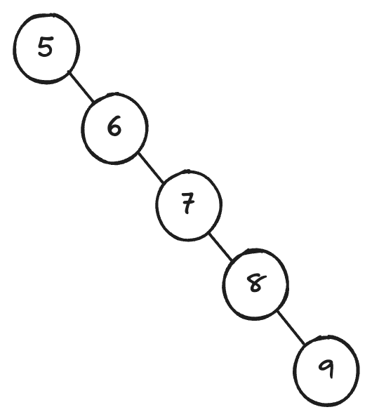
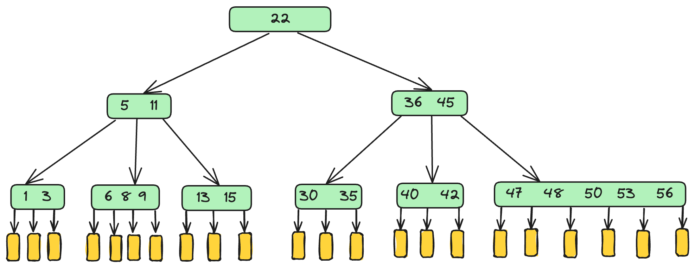
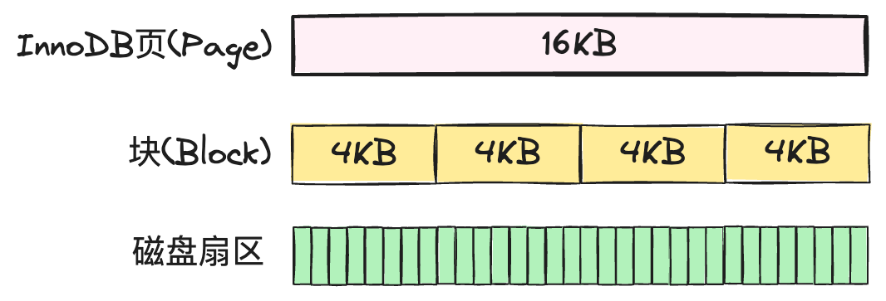
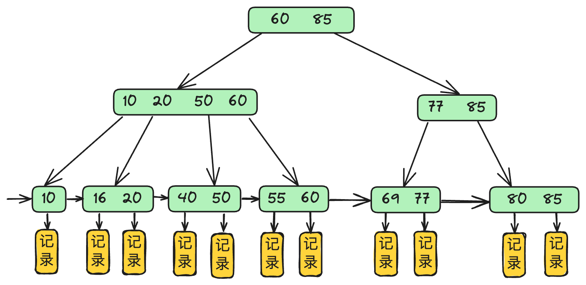
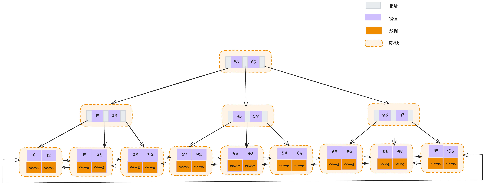
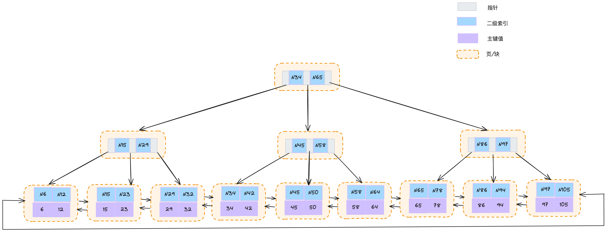

数据库索引好比是一本书的目录，可以直接根据页码找到对应的内容，目的就是为了`加快数据库的查询速度`。索引是对数据库表中一列或多列的值进行排序的一种结构，使用索引可快速访问数据库表中的特定信息。MySQL的索引，是在存储引擎中实现的，而不是在Server层。不同的存储引擎对于索引的实现也存在不同，本文主要探索InnoDB存储引擎所实现的索引。

#### 1. 索引数据结构模型

在了解索引的数据结构前，我们先了解几种数据结构，二叉树搜索树、平衡二叉搜索树、B-Tree、B+Tree

##### 1.1. 二叉搜索树

二叉搜索树（BST）是一种特殊的二叉树，每个顶点最多可以有两个子节点。这种结构遵循**BST属性**，规定给定顶点的左子树中的每个顶点的值必须小于给定顶点的值，右子树中的每个顶点的值必须大于给定顶点的值。最坏的情况是二叉搜索树退化成了链表。


<p align='middle'>二叉搜索树最坏的情况</p>

##### 1.2. 平衡二叉搜索树

 平衡二叉搜索树，它仍是一颗二叉搜索树，它能保持二叉树的高度平衡，尽量降低二叉树的高度，减少树的平均查找长度。平衡二叉搜索树是通过旋转来实现平衡。

- 左子树与右子树高度之差的绝对值不超过1
- 树的每个左子树和右子树都是AVL树
- 每一个节点都有一个平衡因子（balance factor），每一个节点的平衡因子 = 右子树高度 - 左子树高度

##### 1.3. B-Tree

B-Tree即B树，多叉平衡搜索树。磁盘的IO操作耗时较大，应减少磁盘IO操作，二叉搜索树在这方面没有多叉搜索树效率高，而且读取包含多个元素的结点和读取包含一个元素的结点耗时几乎没有区别。B树访问结点是在硬盘上操作的，结点内对数据的操作是在内存上进行的。

* 平衡-所有的叶结点都出现在同一层次上，并且不带信息

* 有序-结点内有序，任一元素左子树都小于它，右子树都大于它

* 多路-对于m阶B树的节点，最多m个分支，m-1个元素；根结点最少2个分支，1个元素，非根结点最少m/2个分支，(m/2)-1个元素；

  <p align='middle'>B树结构示意图</p>

##### 1.4. B+Tree

##### 

<p align='middle'></p>

顺序读和buffer pool可以加快查询速度，所以数据量小的时候，并不会感受到查询效率慢，但是当数据量大的时候，没有索引发生全表扫描就会导致查询变慢。

B+树是应数据库所需而出现的一种B树的变形树。

* 每个分支结点中仅包含它的各个子节点中关键字的最大值及指向其子结点的指针
* 每个分支结点最多有m颗子树
* 所有叶结点包含全部关键字及指向相应记录的指针，叶结点中将关键字按大小顺序排列，并且相邻叶结点按大小顺序相互连接起来


<p align='middle'>B+树结构示意图</p>

>- 二叉查找树：解决了排序的基本问题，但是由于无法保证平衡，可能退化为链表；
>- 平衡二叉树：通过旋转解决了平衡的问题，但是旋转操作效率太低；
>- 红黑树：通过舍弃严格的平衡和引入红黑节点，解决了平衡二叉树旋转效率过低的问题，但是在磁盘等场景下，树仍然太高，IO 次数太多；
>- B 树：通过将二叉树改为多路平衡查找树，解决了树过高的问题；
>- B+ 树：在 B 树的基础上，将非叶节点改造为不存储数据的纯索引节点，进一步降低了树的高度；此外将叶节点使用指针连接成链表，范围查询更加高效。

#### 2. InnoDB B+ Tree

<p align='middle'>主键索引示意图</p>

<p align='middle'>普通索引示意图</p>

#### 3. 回表

通过非主键索引进行查询时，select的字段不能通过非主键索引获取到，需要通过非主键索引找到主键，从聚簇索引再根据主键值再次查询一遍，获取到所要查询的记录，这一过程称之为回表。回表操作主要发生在读取操作（SELECT）中，写入操作（INSERT、UPDATE、DELETE）一般不会触发回表。

（1）如果表定义了PK，则PK就是聚集索引；

（2）如果表没有定义PK，则第一个not NULL unique列是聚集索引；

（3）否则，InnoDB会创建一个隐藏的row-id作为聚集索引；

###### 3.1. 触发回表的情况

* 使用非聚簇索引
* 索引不能覆盖所有需要查询的字段
* 使用了覆盖索引但超过索引最大长度限制([MySQL :: MySQL 8.0 Reference Manual :: 17.22 InnoDB Limits](https://dev.mysql.com/doc/refman/8.0/en/innodb-limits.html))

##### 3.2. 不触发回表的情况

* 使用聚簇索引
* 使用覆盖索引，且未超过索引最大长度限制

#### 4. 覆盖索引

覆盖索引（covering index ，或称为索引覆盖）即索引覆盖了查询需求，可以直接提供查询结果，不需要回表。覆盖索引减少了回表次数，显著提升性能，是MySQL性能优化的手段之一。

在MySql中，可以使用explain查询SQL的执行计划，判断SQL有没有使用到覆盖索引。如果使用了覆盖索引，在Extra字段会输出Using index，表示当前sql使用了覆盖索引。

#### 5. 最左前缀匹配

B+ 树这种索引结构，可以利用索引的“最左前缀”，来定位记录。索引项是按照索引定义里面出现的字段顺序排序的，不只是索引的全部定义，只要满足最左前缀，就可以利用索引来加速检索。这个最左前缀可以是联合索引的最左 N 个字段，也可以是字符串索引的最左 M 个字符。

创建联合索引时，利用最左前缀匹配原则，如果通过调整顺序，可以少维护一个索引，那么这个顺序往往就是需要优先考虑采用的。

#### 6. 索引下推

索引下推(Index Condition Pushdown，简称ICP),是MySQL5.6新增特性。`索引下推`的下推是指将服务层负责的事情，交给了引擎层去处理，能减少回表查询次数，提高查询效率。
索引下推实践：

```mysql
create database test;
use test;
create table s_user(
    id bigint auto_increment primary key,
    name varchar(255),
    age int,
    phone varchar(255),
    address varchar(255)
);

insert s_user (name, age, phone, address) value ('派大星', 10, '122', '地球村');
insert s_user (name, age, phone, address) value ('张三', 12, '133', '公平村');
insert s_user (name, age, phone, address) value ('王五', 12, '144', '深坑洞');
insert s_user (name, age, phone, address) value ('李四', 15, '145', '斗斗村');

create index name_age on s_user(name,age);

explain select * from s_user where name like'星%' and age=10; # 查询结果如下JSON

```

```json
[
  {
    "id": 1,
    "select_type": "SIMPLE",
    "table": "s_user",
    "partitions": null,
    "type": "range",
    "possible_keys": "name_age",
    "key": "name_age",
    "key_len": "1028",
    "ref": null,
    "rows": 1,
    "filtered": 25,
    "Extra": "Using index condition"
  }
]
```

存储引擎根据（name，age）联合索引，找到`name lik '星%'`，由于联合索引中包含`age`列，所以存储引擎直接在联合索引里按照`age=10`过滤。按照过滤后的数据再一一进行回表扫描。
执行计划中可以看到`Extra`一列里`Using index condition`，表示用到了索引下推。

索引条件下推默认是开启的，可以使用系统参数`optimizer_switch`来控制器是否开启。

```mysql
set optimizer_switch="index_condition_pushdown=off";
set optimizer_switch="index_condition_pushdown=on";
```

#### 7. 索引失效

##### 7.1. 典型的失效场景

* 不符合最左前缀匹配原则，对于创建的多列索引，只要查询的条件中用到了最左边的列，或者不是索引列的第一部分，索引一般就会被使用
* like '%'使用错误，‘%星%’与‘%星’则会导致索引失效，不能保证有序性，无法判断往前还是往后走;
* 索引列使用函数
* 列类型是字符串，但where 条件中未把字符常量值用引号引起来，存在隐式转换
* 如果 MySQL 估计使用索引比全表扫描更慢，则不使用索引
* 用 or 分割开的条件，如果 or 前的条件中的列有索引，而后面的列中没有索引， 那么涉及到的索引都不会被用到。
* not in
* is not null (比如: `explain select id from s_user where id is not null;`)[主键索引失效，采用了普通索引]


参考资料

[1] [MySQL :: MySQL 8.0 Reference Manual](https://dev.mysql.com/doc/refman/8.0/en/)

[2]《MySQL实战45讲》

[3] [一文读懂什么是MySQL索引下推（ICP) ](https://www.jianshu.com/p/31ceadace535)

[4] [MySQL explain 应用详解](https://segmentfault.com/a/1190000023565685)
