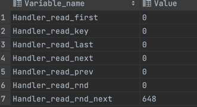

#### 1. 定位执行效率低的SQL语句

- 通过慢查询日志定位那些执行效率较低的 SQL 语句，用--log-slow-queries[=file_name]选项启动时，mysqld 写一个包含所有执行时间超过 long_query_time 秒的 SQL 语句的日志文件。具体可以查看本书第 26 章中日志管理的相关部分。
- 慢查询日志在查询结束以后才纪录，所以在应用反映执行效率出现问题的时候查询慢查询日志并不能定位问题，可以使用 show processlist 命令查看当前 MySQL 在进行的线程， 包括线程的状态、是否锁表等，可以实时地查看 SQL 的执行情况，同时对一些锁表操 作进行优化。

#### 2. 通过EXPLAIN分析低效SQL的执行计划

explain select * from s_user where name like'星%' and age=10;

```
+----+-------------+--------+------------+------+---------------+----------+---------+--------------+------+----------+----------------+
| id | select_type | table  | partitions | type | possible_keys | key      | key_len | ref          | rows | filtered | Extra |
+----+-------------+-------+-------------+------+---------------+----------+---------+--------------+------+----------+----------------+
|  1 | SIMPLE      | s_user |    NULL    | ref  |   name_age    | name_age | 1028    |  const,const | 1    | 100      | null |
+----+-------------+-------+-------------+------+---------------+----------+---------+--------------+------+----------+----------------+
```

- id ：select查询的序列号，包含一组数字，表示查询中执行select子句或操作表的顺序;id相同，从上倒下;id不同，值越大优先级越高;

- select_type ：查询类型或者是其他操作类型;

  | select_type  | 含义                                                         |
  | ------------ | ------------------------------------------------------------ |
  | SIMPLE       | 查询语句中不包含`UNION`或者子查询的查询都算作是`SIMPLE`类型  |
  | PRIMARY      | 对于包含`UNION`、`UNION ALL`或者子查询的大查询来说，它是由几个小查询组成的，<br />其中最左边的那个查询的`select_type`值就是`PRIMARY` |
  | UNION RESULT | 选择使用临时表来完成`UNION`查询的去重工作，针对该临时表的查询的`select_type`就是`UNION RESULT` |
  | SUBQUERY     | 在SELECT或WHERE列表中包含了子查询                            |
  | UNION        | 对于包含`UNION`或者`UNION ALL`的大查询来说，它是由几个小查询组成的，<br />其中除了最左边的那个小查询以外，其余的小查询的`select_type`值就是`UNION` |

- table ：正在访问哪个表

- partitions ：匹配的分区

- type ：访问的类型

  | type        | 含义                                                    |
  | ----------- | ------------------------------------------------------- |
  | system      | 表中仅有一行，即常量表                                  |
  | const       | 单表中最多有一个匹配行，例如primary key或者unique index |
  | eq_ref      | 多表连接中使用primary key或者unique index               |
  | ref         | 使用普通索引                                            |
  | ref_or_null | 与 ref 类似，区别在于 条件中包含对 NULL 的查询          |
  | range       | 单表中的范围查询                                        |
  | index       | 对于前面的每一行，都通过查询索引来得到数据              |
  | all         | 通过全表扫描得到数据                                    |

  

- possible_keys ：显示可能应用在这张表中的索引，一个或多个，但不一定实际使用到

- key ：实际使用到的索引，如果为NULL，则没有使用索引

- key_len ：表示索引中使用的字节数，可通过该列计算查询中使用的索引的长度

- ref ：显示索引的哪一列被使用了，如果可能的话，是一个常数，哪些列或常量被用于查找索引列上的值

- rows ：根据表统计信息及索引选用情况，大致估算出找到所需的记录所需读取的行数

- filtered ：查询的表行占表的百分比

- Extra ：包含不适合在其它列中显示但十分重要的额外信息;

  >* `Using filesort` 表示当SQL中有一个地方需要对一些数据进行排序的时候，优化器找不到能够使用的索引，所以只能使用外部的索引排序，外部排序就不断的在磁盘和内存中交换数据，这样就摆脱不了很多次磁盘IO，以至于SQL执行的效率很低。
  >* `Using temporary` 表示在对MySQL查询结果进行排序时，使用了临时表,,这样的查询效率是比外部排序更低的，常见于`order by`和`group by`。
  >* `Using index` 表示使用了索引
  >* `Using where` 使用了`where`
  >* `Using join buffer` 在连接查询执行过程中，当被驱动表不能有效的利用索引加快访问速度，`MySQL`一般会为其分配一块名叫`join buffer`的内存块来加快查询速度，也就是我们所讲的`基于块的嵌套循环算法`。
  >* `impossible where` 筛选条件没能筛选出任何东西

#### 3. 避免索引失效

#### 4. 查看索引使用情况

 show status like 'Handler_read%';

<p align='middle'></p>

#### 5. 定期优化表

如果已经删除了表的一大部分，或者如果已经对含有可变长度行的表(含有 VARCHAR、 BLOB 或 TEXT 列的表)进行了很多更改，则应使用 OPTIMIZE TABLE 命令来进行表优化。这个 命令可以将表中的空间碎片进行合并，并且可以消除由于删除或者更新造成的空间浪费。OPTIMIZE 执行期间将对表进行锁定，因此一定注意要在数据库不繁忙的时候执行相关的操作。

OPTIMIZE TABLE tbl_name;
#### 6. 常用优化

MySQL中可以通过索引来优化查询，而日常开发中除了查询外，还会使用一些其他的常用SQL，比如INSERT、GROUP BY等，对于这些类型，也有一些优化方式。

* 因为 InnoDB 类型的表是按照主键的顺序保存的，所以将导入的数据按照主键的顺序排列，可以有效地提高导入数据的效率。
* 通过`show variables like '%UNIQUE_CHECKS%';`查看唯一性校验参数;在导入数据前执行 SET UNIQUE_CHECKS=0，关闭唯一性校验，在导入结束后执行 SET UNIQUE_CHECKS=1，恢复唯一性校验，可以提高导入的效率。
* `show variables like '%AUTOCOMMIT%';`如果应用使用自动提交的方式，建议在导入前执行 SET AUTOCOMMIT=0，关闭自动提交，导入结束后再执行 SET AUTOCOMMIT=1，打开自动提交，也可以提高导入的效率。
* 如果同时从同一客户插入很多行，尽量使用多个值表的INSERT语句，这种方式将大大缩减客户端与数据库之间的连接、关闭等消耗。
* 如果从不同客户插入很多行，能通过使用INSERTDELAYED语句得到更高的速度。 DELAYED 的含义是让 INSERT 语句马上执行，其实数据都被放在内存的队列中，并没有 真正写入磁盘，这比每条语句分别插入要快的多;LOW_PRIORITY 刚好相反，在所有其 他用户对表的读写完后才进行插入;
* 当从一个文本文件装载一个表时，使用LOADDATAINFILE。这通常比使用很多INSERT语句快。
* 