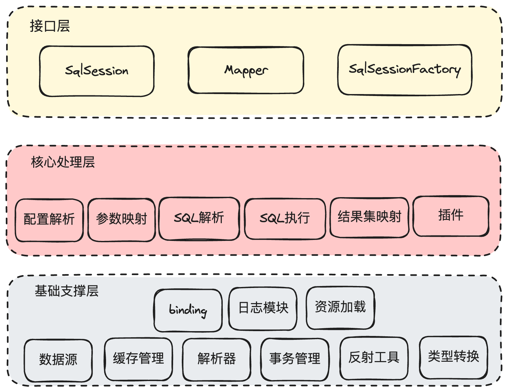

#### 1. 官方文档

https://mybatis.org/mybatis-3

#### 2. 整体架构
MyBatis 分为三层架构，分别是基础支撑层、核心处理层和接口层

##### 2.1. 类型转换模块
>包括MyBatis的别名机制、JDBC类型与Java类型之间的相互转换(参数、结果映射场景)
##### 2.2. 日志模块
>MyBatis提供日志模块集成Log4j2、slf4j等
##### 2.3. 反射工具模块
>在Java原生反射基础上进行封装，缓存Java的原生反射相关的元数据，提升反射执行效率
##### 2.4. Binding 模块
>通过 SqlSession 获取 Mapper 接口的代理，然后通过这个代理执行关联 Mapper.xml 文件中的数据库操作，有错误还可以编译期提示
##### 2.5. 数据源模块
>提供数据源实现，也提供与第三方数据源集成的相关接口
##### 2.6. 缓存模块
>提供一级缓存和二级缓存
##### 2.7. 解析器
>mybatis-config.xml 配置文件解析，Mapper.xml 配置文件解析。
##### 2.8. 事务管理模块
>MyBatis 提供了简单易用的事务接口和实现，但一般情况下，项目都会集成 Spring，会交由 Spring 框架管理事务。
##### 2.9. 配置解析
>在 MyBatis 初始化过程中，会加载mybatis-config.xml 配置文件、Mapper.xml 配置文件以及 Mapper 接口中的注解信息等配置信息，并将解析之后得到的配置对象保存到 Configuration 对象中。
##### 2.10. SQL解析与scripting模块
>根据运行时用户传入的实参，解析动态 SQL 中的标签，并形成 SQL 模板，然后处理 SQL 模板中的占位符，用运行时的实参填充占位符，动态生成数据库真正可执行的SQL语句。
##### 2.11. SQL执行模块
>SQL 语句的真正执行会由 StatementHandler 实现，StatementHandler 会先依赖 ParameterHandler 进行 SQL 模板的实参绑定，然后由 java.sql.Statement 对象将 SQL 语句以及绑定好的实参传到数据库执行，从数据库中拿到 ResultSet，最后，由 ResultSetHandler 将 ResultSet 映射成 Java 对象返回给调用方。
##### 2.12. MyBatis插件

> MyBatis 将插件单独分离出一个模块，位于 org.apache.ibatis.plugin 包中，在该模块中主要使用了两种设计模式：**代理模式**和**责任链模式**。

##### 2.13. MyBatis暴露的接口集合

> 比如SqlSession 接口、SqlSessionFactory 接口，事务管理等，在与spring集成时，可以借助这些暴露的接口，或者我们在实际使用mybatis时，也可以调用。
