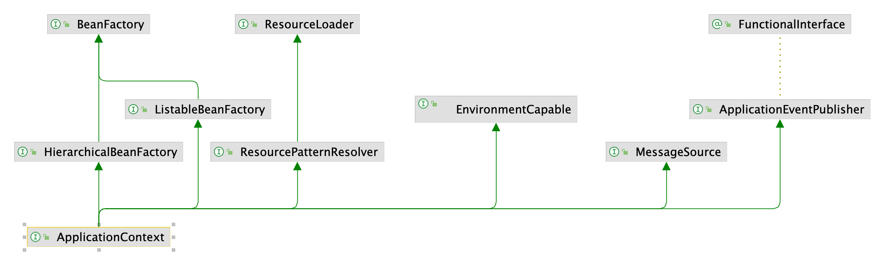
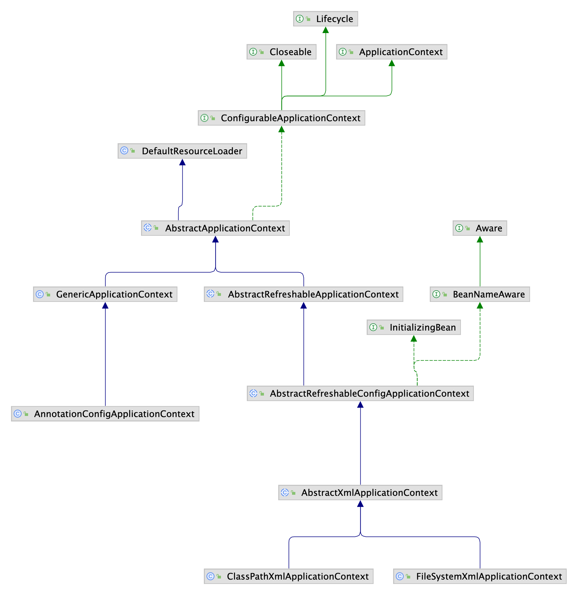

Spring Boot 自动装配的组件最终都会装配到IOC容器，Spring IOC容器在Spring的整个设计中具有重要的地位，想要整体把控Spring就需要理解Spring IOC容器。

Spring IOC容器是控制反转思想的具体实现方式之一，如果不使用IOC技术，开发者需要手动创建、查找、管理业务逻辑对象和依赖，而通过控制反转机制，这些JavaBean组件及其之间的依赖关系的管理将交由Spring IOC容器管理。

org.springframework.beans和org.springframework.context两个包是Spring Framework的IOC容器的基础。BeanFactory接口提供了一种高级配置机制，能够管理不同类型的对象，它是IOC容器的顶层抽象，仅定义了基础的bean对象的管理。ApplicationContext是BeanFactory的子接口，包含了BeanFactory的所有功能，又扩展了更多特性，比如与Spring AOP功能集成、国际化消息资源处理、事件发布、应用层特定的上下文等。

#### 1. IOC容器

##### 1.1. BeanFactory

BeanFactory是用于访问Bean容器的最基本的根接口。

###### 1.1.1. 与BeanFactory相关的接口

* HierarchicalBeanFactory

  > 是BeanFactory的子接口，实现了HierarchicalBeanFactory接口的IOC容器具有层次性。这个接口本身有一个getParentBeanFactory方法可以获取父级容器，而设置父级容器的方法在ConfigurableBeanFactory中。

* ListableBeanFactory

  > 实现了ListableBeanFactory接口的IOC容器具有的最关键的能力是可以将当前容器的Bean对象。

* AutowireCapableBeanFactory

  > 实现了AutowireCapableBeanFactory接口的IOC容器具有支持依赖注入的能力，利用此接口可连接和注入那些Spring Framework无法控制其生命周期的现有bean实例，通常用于与其他框架集成的场景。通常不需要操纵，可以通过ApplicationContext间接获取。

* ConfigurableBeanFactory

  > 普通的BeanFactory只有get相关的操作，而Configurable前缀的BeanFactory或者ApplicationContext则具有set相关的操作，可读可写。可以调用其定义的方法对BeanFactory进行修改扩展等功能，但原则上程序在运行期间不推荐对BeanFactory再进行频繁修改。

###### 1.1.2. 与BeanFactory相关的抽象实现和落地实现

* AbstractBeanFactory

  > AbstractBeanFactory是BeanFactory的最基础的抽象实现类。AbstractBeanFactory中使用模版方法模式(父类提供逻辑规范，子类提供具体步骤的实现)对getBean Definition和createBean进行了规范上的定义，分别代表获取Bean的定义信息，以及创建Bean对象。createBean是Spring框架管控所有Bean的创建入口。

* AbstractAutowireCapableBeanFactory

  > AbstractAutowireCapableBeanFactory实现了AbstractBeanFactory的createBean方法(createBean方法并不是最终实现Bean创建的方法，而是AbstractAutowireCapableBeanFactory中的doCreatBean方法)，还实现了AutowireCapableBeanFactory接口的方法，Bean对象真正的创建动作是在AbstractAutowireCapableBeanFactory中完成的。AbstractAutowireCapableBeanFactory实现的核心功能是：Bean对象的创建、属性的赋值和依赖注入及Bean的初始化逻辑执行，解析Bean的成员中定义的属性依赖关系是在DefaultListableBeanFactory中实现的。

* DefaultListableBeanFactory

  > DefaultListableBeanFactory是目前唯一正在使用的BeanFactory的落地实现，其在AbstractAutowireCapableBeanFactory的基础上完成了注册Bean定义信息的动作，而这个动作是通过BeanDefinitionRegistry实现的。完整的BeanFactory对Bean的管理应该是先注册Bean的定义信息，再完成Bean的创建和初始化动作。

##### 1.2. ApplicationContext

<p align='middle'></p>

ApplicationContext是基于BeanFactory扩展的，应用上下文中不仅包含容器，其核心功能有访问Bean，管理Bean、动态增强、资源加载、事件发布、国际化支持、层级关系支持等。
<p align='middle'></p>

* ConfigurableApplicationContext

  >ConfigurableApplicationContext是ApplicationContext的子接口，为ApllicationContext提供可写能力，接口中提供了refresh、addApplicationListener、addBeanFactoryPostProcessor等方法。

* EnvironmentCapable

* MessageSource

* ApplicationEventPublisher

相较于BeanFactory，ApplicationContext功能更强大。

#### 2. Environment

Environment包含Profile和Property配置的额信息，可以实现统一的配置存储和注入、配置属性的解析等。

```java
public interface ConfigurableEnvironment extends Environment, ConfigurablePropertyResolver {
  
    ......
      
    void setActiveProfiles(String... profiles);

    void addActiveProfile(String profile);

    void setDefaultProfiles(String... profiles);

    ......
    
}
```

#### 3. BeanDefinition

BeanDefinition描述了Spring Framework中Bean的原信息。包含Bean的类信息、属性、行为、依赖关系、配置信息等。

* AbstractBeanDefinition
* BeanDefinitionRegistry->DefaultListableBeanFactory

#### 4. 后置处理器

Spring框架中设计的后置处理器分为两种类型，一种是针对Bean对象的后置处理器BeanPostProcessor；另一个是针对BeanDefinition的后置处理器BeanFactoryPostProcessor。

BeanPostProcessor切入时机是Bean对象的初始化阶段前后添加自定义处理逻辑，BeanFactoryPostProcessor切入的时机是在IOC容器的生命周期中，所有BeanDefinition均注册到BeanDefinitionRegistry后切入回调，主要是访问/修改已存在的BeanDefinition。


参考资料

[1] https://docs.spring.io/spring-framework/

