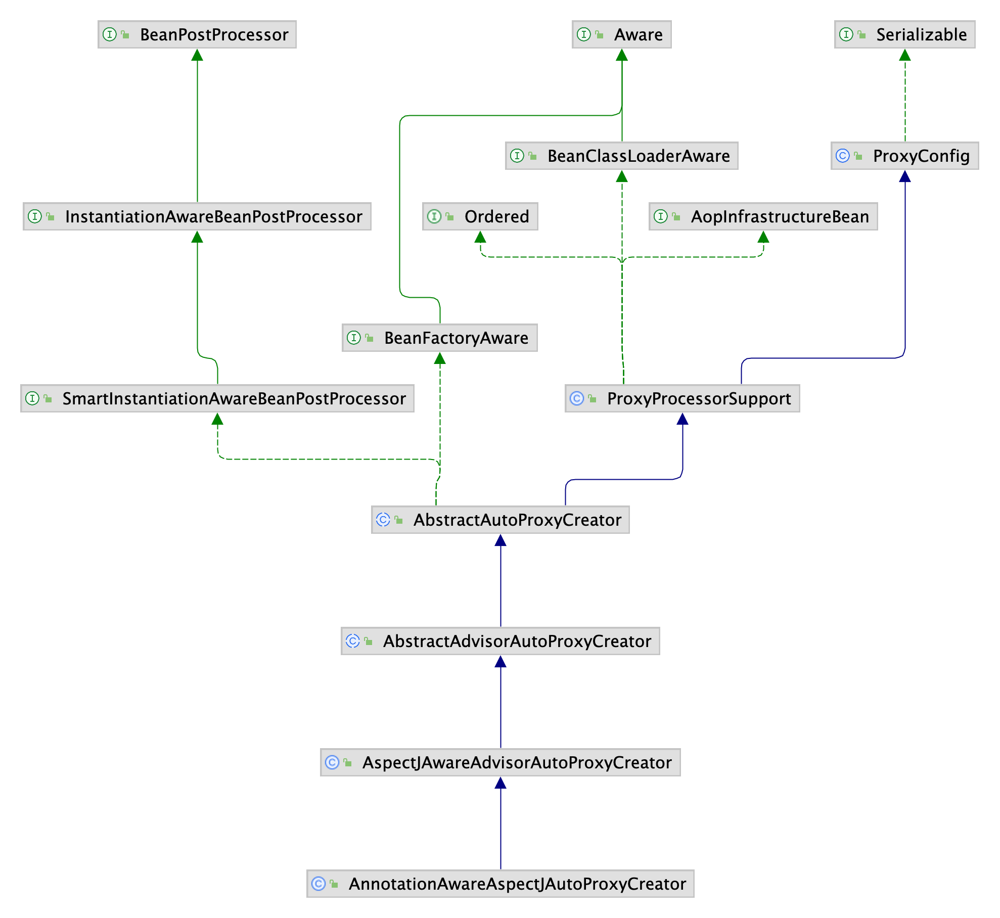

Spring AOP是针对方法进行拦截和增强的，只能应用于方法上，使用Spring AOP可以在约定的流程中将重复的代码抽取出来，给予默认的实现，达到代码的复用以及解耦。

#### 1. AOP基本术语

* Aspect

  > 切面，即切入点与通知组合之后形成的产物

* JoinPoint

  > 连接点，即目标对象的所属类中定义的所有方法。

* Pointcut

  > 切入点，即那些被拦截或者增强的连接点，切入点可以是0个或多个连接点的组合，切入点一定是连接点，连接点不一定是切入点。

* Advice

  > 通知，即增强的逻辑
  > 
  >
  > 基于AspectJ的通知类型：
  > Before前置通知：目标对象的方法调用之前触发
  >
  > After后置通知：目标对象的方法调用之后触发
  >
  > AfterReturning返回通知：目标对象的方法调用成功，在返回结果值之后触发
  >
  > AfterThrowing异常通知：目标对象的方法在运行中抛出或者触发异常后触发
  >
  > Around环绕通知：编程式控制目标对象的方法调用

* Weaving

  > 是一个动词，是将Advice应用到Target目标对象，进而生成Proxy代理对象的过程

* Target

  > 目标对象，即被代理的对象

* Proxy

  > 代理对象，即经过代理后生成的对象

#### 2. AOP使用

在SpringBoot中基于注解@AspectJ的方式开发AOP的流程

* 引入依赖

  > ```xml
  > <dependency>
  >     <groupId>org.springframework.boot</groupId>
  >     <artifactId>spring-boot-starter-aop</artifactId>
  > </dependency>
  > ```

* 确定拦截目标

  > 确定需要拦截什么类的什么方法

* 创建切面类并定义切点

  ```java
  // 声明为切面
  @Aspect
  // 将切面扫描到IOC容器中，使之生效
  @Component
  public class MyAspect {
  
      // 通过正则表达式指定连接点,即哪些类的哪些方法
      // execution表示在执行时，拦截与正则表达式匹配的方法
      // 第一个 * 表示任意返回类型的方法
      // com.dovis.clefairylemonwiki.* 指定目标对象的权限定名称
      // 最后一个 * 表示指定目标对象需要拦截的方法，此处是任意方法
      // (..)表示任意参数进行匹配
      private static final String aopExp = " execution(* com.dovis.clefairylemonwiki.*.*(..))";
  
      // 使用@Pointcut定义切点，后续的通知注解可以使用pointCut方法名来描述需要拦截的方法
      @Pointcut(aopExp)
      public void pointCut(){
  
      }
  
      @Before("pointCut()")
      public void before(JoinPoint joinPoint){
          Object[] args = joinPoint.getArgs();
          // ....
      }
  
      @After("pointCut()")
      public void after(JoinPoint joinPoint){
          // ......
      }
  
      @AfterReturning("pointCut()")
      public void afterReturning(JoinPoint joinPoint){
          // ......
      }
  
      @AfterThrowing("pointCut()")
      public void afterThrowing(JoinPoint joinPoint){
          // ......
      }
  
      @Around("pointCut()")
      public Object around(ProceedingJoinPoint joinPoint) throws Throwable {
          Object result = joinPoint.proceed();
          // ......
          return result;
      }
  }
  ```

#### 3.AnnotationAwareAspectJAutoProxyCreator

<p align='middle'></p>