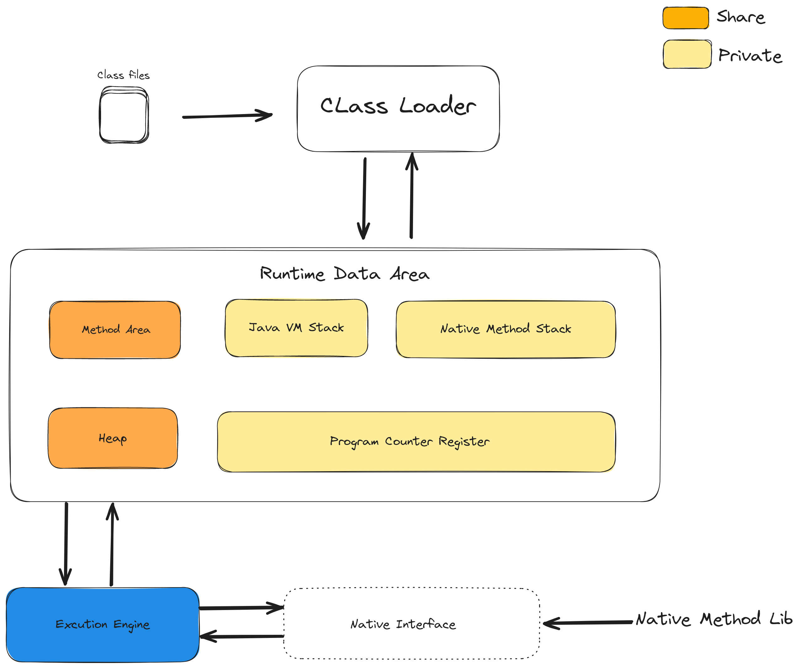
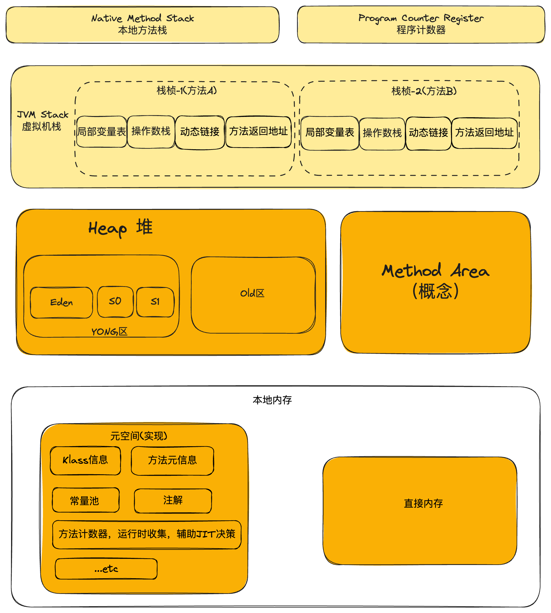

#### 1. JVM的整体结构

<p align='middle'></p>

---

#### 2. JVM内存布局(HotSpot VM)

<p align='middle'></p>

##### 2.1. 程序计数器

1). 程序计数器是一块较小的内存空间，既没有垃圾回收也没有内存溢出，不会出现OutOfMemoryError。用来存储当前线程正在执行的那条字节码指令的地址，每个线程都需要有一个独立的程序计数器。程序计数器是程序控制流的指示器，为分支、循环、跳转、异常处理、线程恢复等基础功能提供支持。

2). 如果线程正在执行的是一个Java方法，这个计数器记录的是正在执行的虚拟机字节码指令的地址；如果正在执行的是本地方法，这个计数值则会是Undefined。

3). Java虚拟机的多线程是通过线程轮流切换并分配处理器执行时间的方式来实现的，在任何一个确定的时刻，一个处理器都只会执行一条线程中的指令。字节码解释器工作时通过改变这个计数器的值来选取下一条需要执行的字节码指令。在多线程情况下，当CUP不停地切换各个线程，当线程切换回来时，通过程序计数器就知道接着从哪继续执行。

##### 2.2. Java虚拟机栈

1). 虚拟机栈描述的是Java方法执行的线程内存模型。

2). 每个线程在创建时都会创建一个虚拟机栈，是线程私有的，生命周期与线程一致。其内部由许多栈帧构成，每个栈帧对应一个Java方法的调用，与数据结构上的栈类似，是一块先进后出的数据结构，支持出栈和入栈两种操作。

3). 每个方法被执行的时候，JVM都会同步创建一个栈帧用于存储局部变量表、操作数栈、动态链接、方法出口等信息。每一个方法被调用直至执行完毕的过程，就对应着一个栈帧在虚拟机栈中从入栈到出栈的过程。不存在垃圾回收的问题，存在内存溢出的问题。

4). 该内存区域会存在两类异常：StackOverflowError异常和OutOfMemoryError异常；

* 如果采用固定大小的Java虚拟机栈，那每一个线程的Java虚拟机栈容量在线程创建的时候按照固定大小来设置，如果线程请求分配的栈容量超过Java虚拟机栈允许的最大容量，JVM将会抛出StackOverflowError异常。

* 如果Java虚拟机可以动态扩展，并且在尝试扩展的时候无法申请到足够的内存(目前HotSpot虚拟机中不支持栈大小动态扩展)，或者在创建新的线程时没有足够的内存去创建对应的虚拟机栈，那JVM将会抛出OutOfMemoryError异常(OOM溢出)。

5). 栈帧内容

* 局部变量表

  被定义为一个数字数组，主要用于存储方法参数和定义在方法体内的局部变量，数据类型包括各种基本数据类型、对象引用以及returnAddress类型。对于基本数据类型的变量，直接存储它的值，对于引用类型的变量，则存的事指向对象的引用。

  局部变量表的容量大小在编译期确定下来，最基本的存储单元是slot(变量槽)，32位以内占用一个槽，64位占用两个槽。JVM为局部变量表中的每一个slot分配一个访问索引，通过这个索引即可成功访问到局部变量表中指定的局部变量值。

  一个变量占两个槽，则当调用该变量时，用它的起始索引。

  栈帧中的局部变量表中的slot可以重用，当一个局部变量过了其作用域，在其作用域之后申明的新的局部变量就有可能复用过去局部变量的slot。

  **在栈帧中，与性能调优关系密切的就是局部变量表，在方法执行时，虚拟机使用局部变量表完成方法的传递。局部变量表中的变量也是重要的垃圾回收根节点，只要被局部变量表直接或间接引用的对象都不会被回收。**

* 操作数栈

  主要用于保存计算过程的中间结果，同时作为计算过程中变量临时的存储空间。

  操作数栈是JVM执行引擎的一个工作区，每一个操作数栈都拥有一个明确的栈深度用于存储数据，最大深度在编译期定义好。可以是任意Java数据类型，32位占用一个栈身体，64位占用两个栈深度。

  数据访问方式不是采用访问索引，而是通过标准的入栈和出栈操作完成一次数据方法。

  栈顶缓存技术：操作数存储在内存中，频繁执行内存读写操作必然影响执行速度，为提升性能，HotSpot虚拟机提出栈顶缓存技术。所谓的栈顶缓存技术就是当一个栈的栈顶或栈顶附近元素被频繁访问，就会将栈顶或栈顶附近的元素存到物理CPU的寄存器中，降低对内存的读写次数，提升执行引擎的执行效率。

* 动态链接

  用于在JVM加载字节码文件，将类数据加载到内存以后，当前栈帧能够清楚记录此方法的来源。将字节码文件中记录的符号引用转换为调用方法的直接引用，直接引用就是程序运行时方法在内存中的具体地址。

* 方法返回地址

##### 2.3. 本地方法栈

1). 本地方法栈是为JVM运行Native方法准备的空间，用于管理本地方法的调用。

2). 本地方法栈与虚拟机栈关联方式：当调用线程的start()方法时，在当前线程中开辟一个start()方法的栈帧并压入栈，在start()方法中又调用了start0()方法，start0()方法是一个本地方法，start0()方法需要通过本地方法栈调用，可以使用动态链接的方式直接指向本地方法，由执行引擎来执行本地方法。

3). 本地方法栈会存在两类异常：StackOverflowError异常和OutOfMemoryError异常；

##### 2.4. 方法区

JDK7及之前，方法区的实现是永久代；JDK8及之后，移除了永久代，取而代之的是在本地内存中实现元空间。

1). 容量大小

  不是固定的，可以根据应用的需要动态调整，-XX:MetaspaceSize和-XX:MaxMetaspaceSize,此区域会发生OOM异常，FullGC，需要设置合理的大小，以避免频繁的FullGC

2). 存储内容

* 类型信息(Klass结构)：完整有效的全类名，包括报名和类名；直接父类的完整有效名；修饰符；直接接口的一个有序列表。
* 域信息：类型的所有域的相关信息及域的声明顺序。
* 方法信息：方法名称；方法返回类型、按照顺序保存方法参数的数量和类型；方法的修饰符(访问权限，static，final，synchronized、native、abstract的一个子集)、方法的字节码、操作数栈深度、局部变量表大小(abstract和native的除外)、异常表(abstract和native的除外)[异常开始结束位置，被捕获的异常类的常量池索引等]。
* 运行时常量池
* JIT代码缓存
* ...

3). 分配Metaspace空间

  当一个类被加载时，它的类加载器会负责在 Metaspace 中分配空间用于存放这个类的元数据。

4). 回收Metaspace空间

  分配给一个类的空间，是归属于这个类的类加载器的，只有当这个类加载器卸载的时候，这个空间才会被释放。所以，只有当这个类加载器加载的所有类都没有存活的对象，并且没有到达这些类和类加载器的引用时，相应的 Metaspace 空间才会被 GC 释放。所以，一个 Java 类在 Metaspace 中占用的空间，它是否释放，取决于这个类的类加载器是否被卸载。释放 Metaspace 的空间，并不意味着将这部分空间还给系统内存，这部分空间通常会被 JVM 保留下来。这部分被保留的空间有多大，取决于 Metaspace 的碎片化程度。另外，Metaspace 中有一部分区域 Compressed Class Space 是一定不会还给操作系统的。[引用[深入理解堆外内存 Metaspace_Javadoop](https://javadoop.com/post/metaspace)]

##### 2.5. 堆

1). 用来存放对象的内存区域，每个JVM实例对应唯一的堆空间，其大小可通过参数调节，在JVM启动时被创建，大小在创建后固定。可以处于物理上不连续的内存空间中，但在逻辑上应被视为连续的。堆中存放的是对象，栈帧中保存的是对象引用，这个引用指向对象在堆中的位置。

2). 设置堆大小

 -Xms：初始内存大小；

 -Xmx：最大内存大小；

 为避免服务器在运行过程中，堆空间不断扩容与回缩带来的系统压力，通常情况下两个大小设置相同

3). 堆区划分新生代老年代

 -XX:NewRatio: 表示新生代和老年代在堆结构中的占比，默认设置是”-XX:NewRatio=2“,表示新生代占比为1，老年代占比为2

4). 新生代

  HotSpot中新生代又分为Eden区和两个Survivor区

  -XX:SurvivorRatio: 表示Eden区和两个Survivor区的占比，“-XX:SurvivorRatio=3”表示Eden区和两个Survivor区的占比为3:1:1

5). 对象分配过程

* new的对象先放在Eden区，Eden区大小是有限制的。
* 当Eden区空间填满，此时又需创建对象，则Eden区发生Minor GC，将Eden区中不再被其他对象所引用的对象进行销毁，再加载新的对象到Eden区。
* 将Eden区中剩余对象移动至Survivor0区，被移动到S0区的对象上有一个年龄计数器，值为1
* 再次触发垃圾回收，此时垃圾收集器将对Eden区和S0区进行垃圾回收，没有被垃圾回收的对象就会移动到S1区，S0区移动到S1区的对象的年龄计数变为2，Eden区移动过来的对象年龄是1。
* 再次触发垃圾回收，没有被回收的对象再次回到S0区，依次循环，默认是15次，超过15的对象进入老年代区。可以通过参数： -XX:MaxTenuringThreshold=N进行设置
* 其中有一些情况会直接分配到老年代：大对象，或者是，通过动态年龄分析如果Survivor区中相同年龄的所有对象大小总和大于Survivor区一半，年龄大于或者等于该年龄的对象直接进入老年代。
* 在老年代，内存相对充足。当老年代内存不足时，再次触发GC，此时可能发生MajorGC或者FullGC，进行老年代内存清理。
* 若老年代执行MajorGC后发现依然无法进行对象的保存，则会产生OOM异常。

6). GC分类

* 新生代GC(Minor GC): 只进行新生代的垃圾收集
* 老年代GC(Major GC): 只进行老年代的垃圾收集
* 混合GC(Mixed GC): 收集整个新生代以及部分老年代的垃圾收集，如G1 GC
* 整堆GC(Full GC): 整个Java堆和方法区的垃圾收集

7). 分代GC触发条件

* 新生代GC(Minor GC)触发机制：Eden区空间不足
* 老年代GC(Major GC)触发机制：老年代空间不足，先触发MinorGC
* FullGC触发机制
  - 调用System.gc(),有可能执行
  - 老年代空间不足
  - 方法区空间不足
  - 老年代的最大可用连续空间小于历次晋升到老年代对象的平均大小
  - 由Eden区，S0区向S1区复制，如果对象大小大于S1区可用内存，则把该对象转存到老年代，且老年代可用内存小于该对象大小。
* 三种GC均会发生STW，FullGC的STW时间最长。
  

8). TLAB(Thread Local Allocation Buffer)线程本地分配缓存区

* 存在Eden区
* 堆区线程共享，多线程同时分配内存时，使用TLAB可以避免线程安全问题
* 对象在TLAB空间分配内存失败，JVM将会尝试通过使用加锁机制确保数据操作的原子性

9). 逃逸分析

  分析对象的动态作用域，通过逃逸分析，HotSpot能够分析出一个新对象引用的使用范围，决定是否需要将对象分配到堆上，有可能被优化在栈上分配。

  通过逃逸分析，编译器可以对程序进行以下优化：栈上分配、同步省略(锁消除)、标量替换

---

#### 3. 直接内存(堆外内存)

  Java堆外内存、直接向操作系统申请的内存区间。

  直接内存来源于NIO，可以通过ByteBuffer类操作。ByteBuffer类调用allocateDirect()方法可以申请直接内存，方法内部创建一个DirectByteBuffer对象，DirectByteBuffer对象存储直接内存的起始地址和大小，据此可以操作直接内存。

```java
public abstract class ByteBuffer extends Buffer implements Comparable<ByteBuffer>
{
    ...
    public static ByteBuffer allocateDirect(int capacity) {
        return new DirectByteBuffer(capacity);
    }
    ...
}

class DirectByteBuffer extends MappedByteBuffer implements DirectBuffer
{
    ...
    // Primary constructor
    DirectByteBuffer(int cap) {                   // package-private
        ...
        base = UNSAFE.allocateMemory(size);
        ...
        UNSAFE.setMemory(base, size, (byte) 0);
        ...
    }
   ...
}

```

#### 4. 对象的内存布局及访问定位

1). 内存布局

  对象在内存中的布局可以分成对象头(Header)、实例数据(Instance Data)、对齐填充(Padding)

* 对象头：mark-word(哈希值、GC分代年龄、锁状态标志、偏向线程 ID、线程持有的锁、若是数组需包含记录数组长度的数据等)，类型指针
* 实例数据：成员变量的值，其中包括父类成员变量和本类成员变量
* 对齐填充：用于确保对象的总长度为 8 字节的整数倍，起到占位符的作用。

2). 创建对象的方式

* 使用new关键字
* 使用Class的newInstance()方法
* 使用clone()
* ...etc

3). 创建对象的步骤

* **判断对象对应的类是否加载、链接、初始化**
* **为对象分配内存**：内存规整采用指针碰撞(使用过的在一边，未使用的在一边，中间用一个指针作为分界点指示器，需要分配时仅将指针向空闲块移动与对象大小相等的距离)；内存不规整采用空闲列表分配(已使用和未使用内存相互交错，虚拟机维护一个列表，记录哪些内存可用，在内存分配时从列表中找到一块足够大的空间划分给实例对象。)
* **处理并发安全问题**：为保证new对象的线程安全，虚拟机采用两种方式解决并发问题。一种CAS(CAS操作包含三个操作数，内存位置、预期值和新值，实现逻辑是将内存位置处的数值与预期值相比较，若相等，则将内存位置处的值替换为新值；不相等则不做任何操作)。另一种是TLAB，每个线程在Java中预先分配一小块内存，然后按照线程划分在不同的空间之间进行内存分配。
* **初始化分配到的空间**
* **设置对象的对象头**
* **执行init()方法进行初始化**

4). 对象的访问定位方式

* 使用句柄访问
* 直接指针访问-HotSpot采用直接指针访问


---

参考文献

[1]周志明.深入理解Java虚拟机第三版[M].北京.机械工业出版社.2019

[2]Javadoop.(2019,Dec 24)[深入理解堆外内存 Metaspace_Javadoop](https://javadoop.com/post/metaspace)

[3]Oracle.[The Java® Virtual Machine Specification (oracle.com)](https://docs.oracle.com/javase/specs/jvms/se8/html/index.html)

[4]stuefe.de.[What is Metaspace? | stuefe.de](https://stuefe.de/posts/metaspace/what-is-metaspace/)

[5]Java Magazine.[escape-analysis-in-the-hotspot-jit-compiler](https://blogs.oracle.com/javamagazine/post/escape-analysis-in-the-hotspot-jit-compiler)