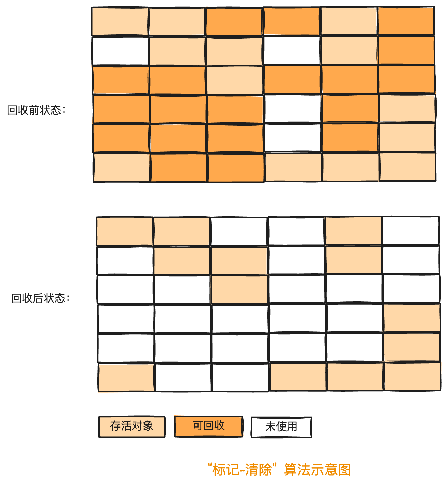
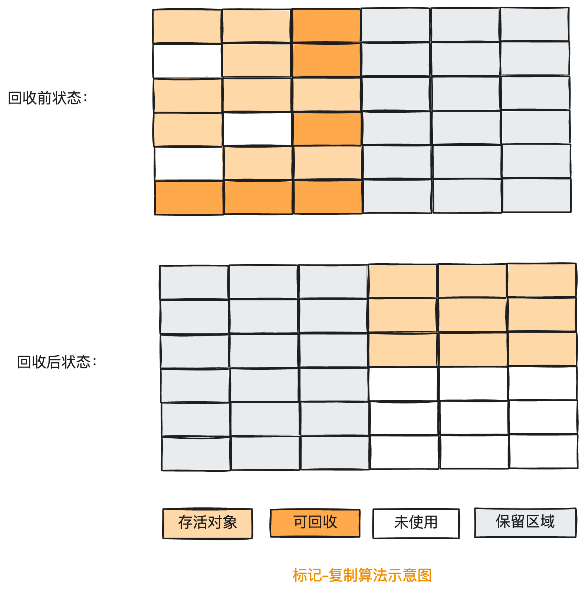
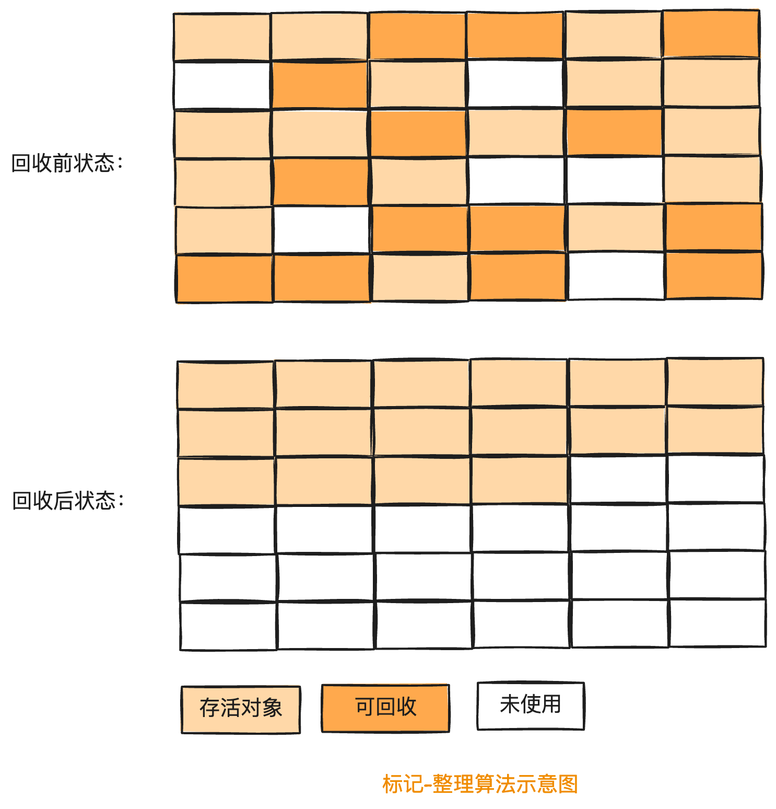
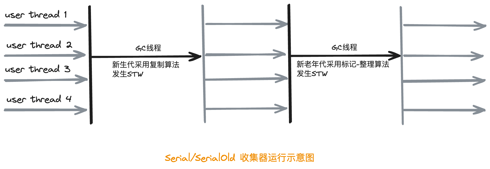
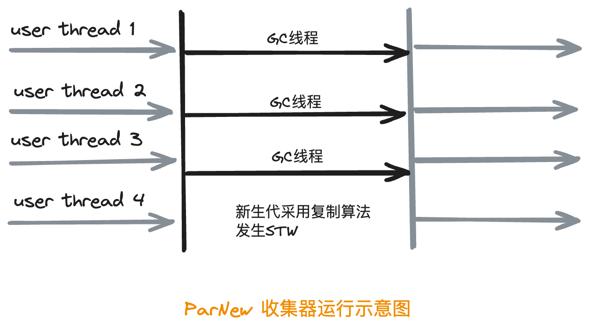
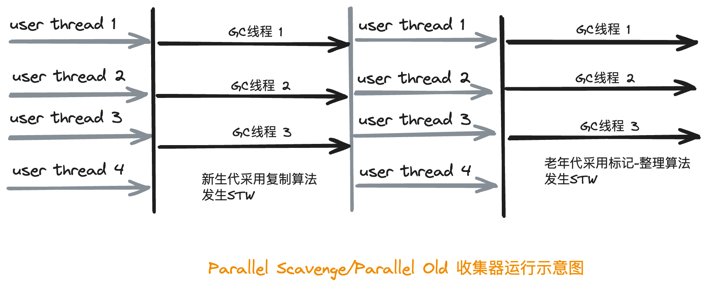
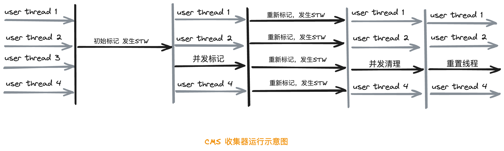

Java虚拟机栈、本地方法栈、程序计数器都是线程私有的，生命周期同线程一致，随着线程的创建而创建，随着线程的结束其空间自动被回收。Java的垃圾收集机制主要作用于运行时数据区中的堆和方法区。

#### 1. 对象存活判断

  在GC执行垃圾回收之前，首先要区分出内存中哪些是存活对象，哪些是已经死亡的对象。只有被标记为死亡的对象，GC才会在执行垃圾回收时，释放掉其所占用的内存空间。若一个对象不被任何对象或变量引用，那么它就是无效对象，需要被回收。

判断对象存活一般有两种方式：引用计数算法和可达性分析算法。

1). 引用计数算法：堆每个对象保存一个整形的引用计数器属性，用于记录对象被引用的次数。但这样会增加存储空间开销，时间开销，严重的是无法处理循环引用的情况。

2). 可达性分析算法：以GC Root(根对象)为起始点，按照从上至下的方式搜索被根对象集合所连接的目标对象是否可达。GC Root不止一个，构成一个集合，称为“GC Roots”

#### 2. GC Roots

 GC Roots集合中的对象引用包括以下类型

- 虚拟机栈中对象的引用
- 本地方法栈内对象的引用
- 方法区中引用数据类型的静态变量
- 方法区中常量对象的引用
- 所有被同步锁synchronized持有的对象引用
- JVM内部的引用，如基本数据类型对应的Class对象引用，常驻异常对象引用，系统类加载器引用对象等。

#### 3. 四种引用

 针对不同引用类型的对象，GC的态度是完全不同的。

1). 强引用(StringReference): 只要强引用关系存在，无论任何情况垃圾收集器都永远不会回收掉被引用的对象。

2). 软引用(SoftReference)：内存溢出前，垃圾收集器收集完垃圾对象的内存后，内存仍然吃紧，则会回收软引用的对象。

3). 弱引用(WeakReference)：垃圾收集器工作时，无论内存是否足够，都会回收被弱引用关联的对象。

4). 虚引用(PhantomReference)

#### 4. 内存溢出与内存泄露

#### 5. 垃圾收集算法

###### 5.1. 标记-清除算法

###### 5.2. 复制算法

###### 5.3. 标记-整理算法

###### 5.4. 分代收集算法

  不同对象的生命周期不一样，因此在HotSpot的JVM中，把Java堆分为新生代和老年代，生命周期较短的对象一般放在新生代，生命周期较长的对象会进入老年代。不同区域的对象，采用不同的收集方式，以便提高回收效率。

#### 6. 垃圾收集器

###### 6.1. 串行收集器

  串行垃圾收集器是指使用单线程进行垃圾回收，垃圾回收时，只有一个线程在工作，并且Java应用中的所有线程都要暂停，等待垃圾回收完成。

* Serial GC

* Serial Old GC

  

  

###### 6.2. 并行收集器

  并行垃圾收集器在串行垃圾收集的基础之上做了改进，将单线程改为多线程进行垃圾回收。

* ParNew GC

  

* Parallel Scavenge GC

* Parallel Old GC

  

###### 6.3. 并发收集器

  并发垃圾收集器是指垃圾收集线程和用户线程同时运行。

 **1). CMS(Concurrent Mark Sweep)[JDK14中彻底删除CMS]**

- 初始标记(CMS initial mark)：标记出GC Roots能直接关联到的对象

- 并发标记(CMS concurrentmark)

- 重新标记 (CMS remark)：修正正在并发标记期间因用户程序继续运行而导致标记产生变动的那一部分对象的标记记录，需要一次重新标记操作。

- 并发清除 (CMS concurrent sweep)：清理已经被标记为死亡的对象，释放内存空间，不需要移动存活对象，可以与用户线程同时并发。

  

   CMS采用标记-清除算法，在为新对象分配内存空间时，将无法使用指针碰撞，只能选择空闲列表执行内存分配。

   -- CMS的主要缺陷是对处理器的使用率高，CMS处理器数=(处理器核心数+3)/4；CMS处理器占比>=25%

 **2). G1(Garbage First)[JDK9后默认的垃圾收集器]**

   基于并行和并发的收集器，其将堆内存分割为很多区域(Region),物理上不连续，但逻辑上连续。关注点在于达到可控的停顿时间基础上尽可能提高吞吐量。

* G1收集器将Java堆划分成约2048个大小相同的独立Region块，每个Region块大小根据堆空间的实际大小而定，整体控制在1M到32M，且为2的N次幂，可以通过参数“- XX:G1HeapRegionSize”设定，所有Region大小相同。

* 一个Region的角色可以是Eden、Survivor、Old或者Humongous，一个Region只可能属于一个角色。当一个对象大于一个Region区的1/2大小时，就可认定是大对象，一个H区装不下一个大对象，G1会寻找连续的H区来存储。

* 优先清除垃圾最多的Region，以达到收益最大化，也是G1名称的由来原因。

* G1垃圾回收过程包括三个环节：Minor GC、老年代并发标记、混合回收(Mixed GC)

* Minor GC发生Stop The Word，最长停顿时间可以通过参数`-XX:MaxGCPauseMillis`,默认是200ms，最好不要随意修改。

  

* Remeber Sets(RSet): 每个Region都有一个对应的Remember Set,用于记录本区域中所有对象引用的对象所在的区域。

* Collection Sets：混合回收的回收集。

* 三色标记法

* SATB(Snapshot At The Beginning):初始快照

* G1 GC的SATB写屏障

###### 6.4. 垃圾收集器新发展

* ZGC

---

参考资料

[1]Oracle.[Getting Started with the G1 Garbage Collector (oracle.com)](https://www.oracle.com/technetwork/tutorials/tutorials-1876574.html)

[2]Oracle.[OpenJDK Mercurial Repositories](https://hg.openjdk.org/)

[3]OpenJDK源码.https://hg.openjdk.org/