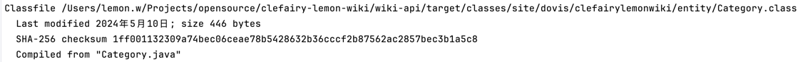
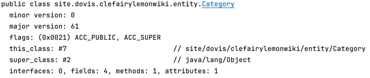
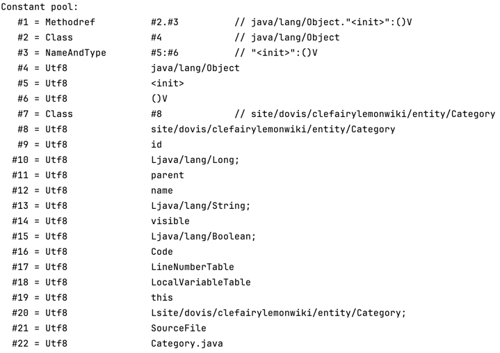
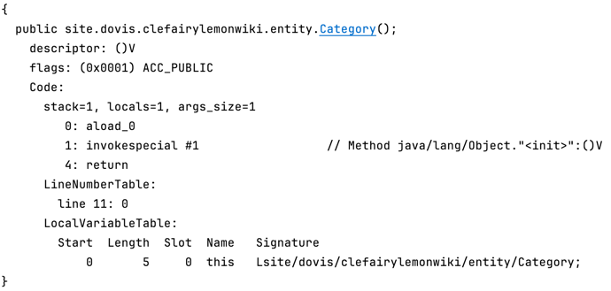
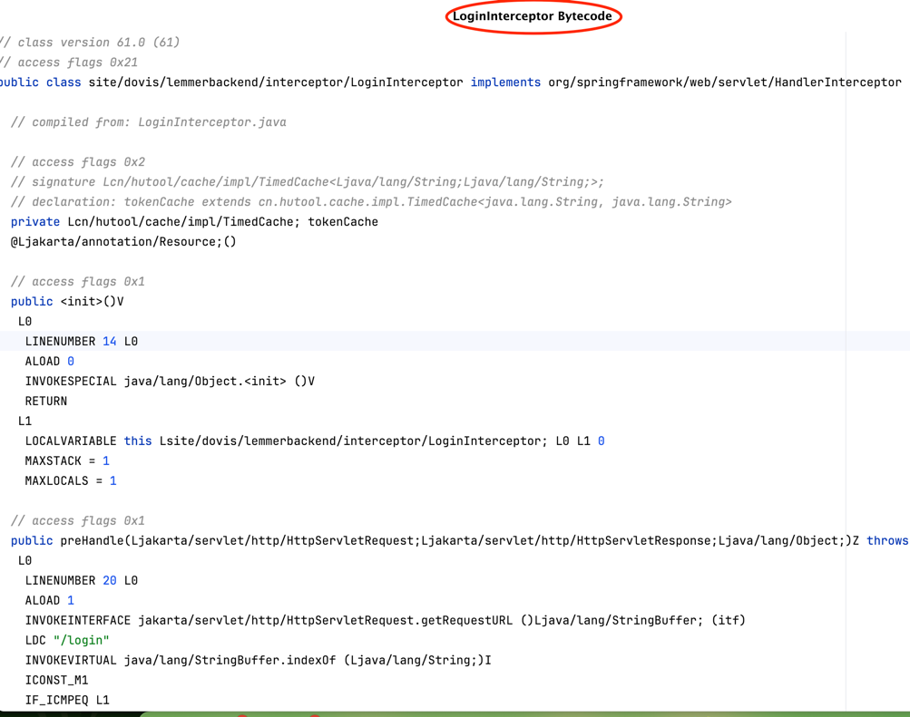
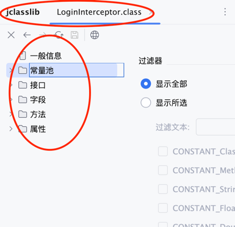
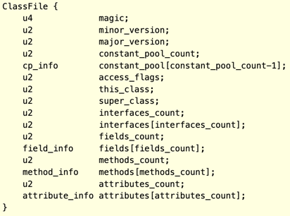

由于class文件是二进制形式的，需要使用一些工具将class文件解析成可以直接阅读的形式。解析方式可以使用`javap指令`或者idea中插件**jclasslib**

* `javap指令`

  在终端执行`javap -v Category.class`，结果如下: 

  

  

  

  

  

* **jclasslib**

  点击View->点击Show Bytecode Or Show Bytecode With Jclasslib

#### 1. class文件结构

图片来源于Oracle官网

#### 2. 字节码指令集

#### 3. 类加载过程

#### 4. 类加载器

 

