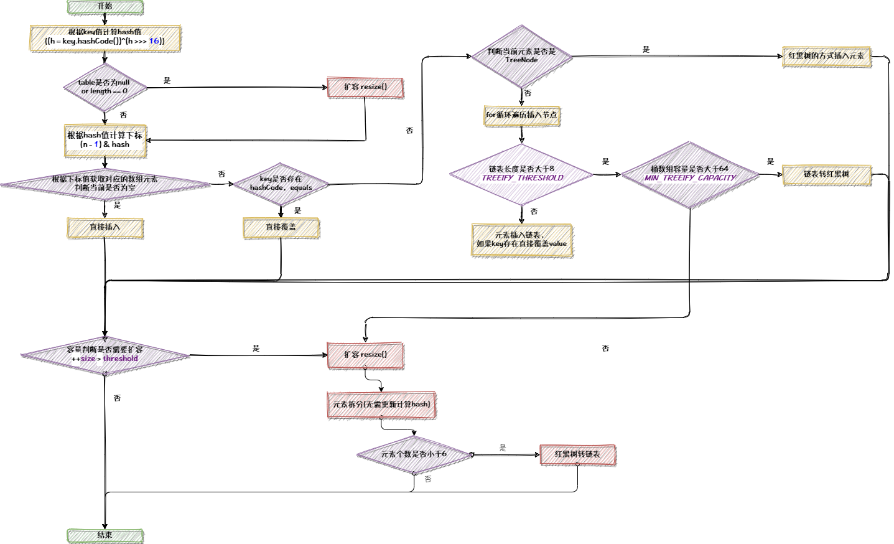

Map是一个接口

```java
public interface Map<K, V> {
      ...
}
```

* Map元素存储在键值对中，不能包含重复的key，每个key与一个value关联。

* 每个Map包含三个不同的sets，`Set<K> keySet()`、`Collection<V> values()`、`Set<Map.Entry<K, V>> entrySet()`

* Map接口的实现类有`HashMap`、`EnumMap`、`LinkedHashMap`、`WeakHashMap`、`TreeMap`；继承了Map接口的子接口中有`ConcurrentMap`，`ConcurrentMap`的实现有`ConcurrentHashMap`。
* Map中提供的方法有`put(K, V)` 、`putAll()` 、`putIfAbsent(K, V)` 、 `get(K)` 、 `getOrDefault(K, defaultValue)` 、`containsKey(K)` 、`containsValue(V)` 、 `replace(K, V)` 、`replace(K, oldValue, newValue)` 、 `remove(K)` 、 `remove(K, V)` 、 `keySet()` 、`values()` 、`entrySet()` 

#### 1. HashMap

* ##### 1.1. 初始化

  为了减少链表的碰撞次数，尽可能的选择不可变的类型作为Key，因其不可变性，其HashCode的值也会不可变。如String类型。

  HashMap的扩容机制比较耗时，所以为了减少扩容次数，在知道要存放多少元素的前提下最好指定HashMap的链表初始大小。

  使用HashMap做缓存时，因其线程不安全特性，最好使用ConcurrentHashMap代替。

  ```java
  //JDK8 & JDK17 hashMap creation with 16 capacity and 0.75f load factor
  HashMap<String, Integer> numbers = new HashMap<>();
  System.out.println("Initial HashMap: " + numbers);
  
  // output
  // Initial HashMap: {}
  ```

* ##### 1.2. 添加元素(`put()`、`putAll()`、`putIfAbsent()`、)

  ```java
  // put() method to add elements
  numbers.put("One", 1);
  numbers.put("Two", 2);
  numbers.put("Three", 3);
  System.out.println("HashMap after put(): " + numbers);
  
  // output
  // HashMap after put(): {One=1, Two=2, Three=3}
  ```

  key相同如果使用put会覆盖原来的值。

  ```java
  if (!onlyIfAbsent || oldValue == null)
      e.value = value;
  ```

* ##### 1.3. 获取元素(`get()`、`keySet()`、`values()`、`entrySet()`、`getOrDefault()`)

  ```java
  // get() method to get value
  String value = languages.get(1);
  
  // return set view of keys
  // using keySet()
  System.out.println("Keys: " + numbers.keySet());
  
  // return set view of values
  // using values()
  System.out.println("Values: " + numbers.values());
  
  // return set view of key/value pairs
  // using entrySet()
  System.out.println("K/V mappings: " + numbers.entrySet());
  ```

* ##### 1.4. 更新元素(`replace()`、`replaceAll()`)

  ```java
  // change element with key 2
  numbers.replace(2, "C++");
  ```

* ##### 1.5. 移除元素

  ```java
  // remove element associated with key 2
  String value = numbers.remove(2);
  ```

* ##### 1.6. 遍历元素

```java
//方法一
for (String key : numbers.keySet()) {
}

//方法二
for (Map.Entry<String, Integer> entry : numbers.entrySet()) {
    String key = entry.getKey();
}

//方法三(在这个遍历中删除不会抛出异常)
Iterator<Map.Entry<String, Integer>> iterator = numbers.entrySet().iterator();
while (iterator.hasNext()){
    Map.Entry<String, Integer> next = iterator.next();
    if("35".equals(next.getKey())){
      iterator.remove();
      System.out.println("delete:"+ next.getValue());
    }
}
```

* ##### 1.7. modCount

  和`ConcurrentModificationException`结合，遍历(foreach、replaceAll)时校验值是否发生变化，发生变化则会抛出`ConcurrentModificationException`异常。

  使用 Iterator 本身的方法 remove() 来删除对象， Iterator.remove() 方法会在删除当前迭代对象的同时维护索引的一致性。所以Iterator的remove方法可以安全的删除对象。

* ##### 1.8. 底层数据结构

  `JDK1.8`前`HashMap`由数组+链表组成，JDK1.8后由数组+链表+红黑树组成。

* ##### 1.9. 散列函数

  ```java
  static final int hash(Object key) {
      int h;
      return (key == null) ? 0 : (h = key.hashCode()) ^ (h >>> 16);
  }
  ```

  优化散列值，增加随机性，减少hash碰撞；

* ##### 1.10. 负载因子

  决定数据量多少时进行扩容，默认0.75f

* ##### 1.11. put流程

  <p align='middle'></p>

* ##### 1.12. 扩容机制及扩容元素拆分

  一般情况下扩容成原来容量的两倍`newCap = oldCap << 1`

  ```java
  final Node<K,V>[] resize() {
      Node<K,V>[] oldTab = table;
      int oldCap = (oldTab == null) ? 0 : oldTab.length;
      int oldThr = threshold;
      int newCap, newThr = 0;
      if (oldCap > 0) {
          // 超过最大容量不再进行扩容
          if (oldCap >= MAXIMUM_CAPACITY) {
              threshold = Integer.MAX_VALUE;
              return oldTab;
          }
          // 没有超过最大容量，新容量是原来的2倍
          else if ((newCap = oldCap << 1) < MAXIMUM_CAPACITY &&
                   oldCap >= DEFAULT_INITIAL_CAPACITY)
              newThr = oldThr << 1; // double threshold
      }
      else if (oldThr > 0) 
          newCap = oldThr;
      else {               
          newCap = DEFAULT_INITIAL_CAPACITY;
          newThr = (int)(DEFAULT_LOAD_FACTOR * DEFAULT_INITIAL_CAPACITY);
      }
      if (newThr == 0) {
          float ft = (float)newCap * loadFactor;
          newThr = (newCap < MAXIMUM_CAPACITY && ft < (float)MAXIMUM_CAPACITY ?
                    (int)ft : Integer.MAX_VALUE);
      }
      threshold = newThr;
      @SuppressWarnings({"rawtypes","unchecked"})
      // 创建新的table
      Node<K,V>[] newTab = (Node<K,V>[])new Node[newCap];
      table = newTab;
      if (oldTab != null) {
          // 遍历旧的hash表
          for (int j = 0; j < oldCap; ++j) {
              Node<K,V> e;
              if ((e = oldTab[j]) != null) {
                  // 释放空间
                  oldTab[j] = null;
                  // 当前节点不是以链表的形式存在，则重新计算在桶中位置然后赋值
                  if (e.next == null)
                      newTab[e.hash & (newCap - 1)] = e;
                  // 红黑树的形式则进行红黑树的操作
                  else if (e instanceof TreeNode)
                      ((TreeNode<K,V>)e).split(this, newTab, j, oldCap);
                  else { // preserve order
                      // 以链表的形式存在的节点，通过（e.hash & oldCap) == 0来判断是插入low还是high链表中
                      Node<K,V> loHead = null, loTail = null;
                      Node<K,V> hiHead = null, hiTail = null;
                      Node<K,V> next;
                      do {
                          next = e.next;
                          // e.hash & oldCap) == 0 表示不变，不等于0则是原索引值加旧容量值
                          if ((e.hash & oldCap) == 0) {
                              if (loTail == null)
                                  loHead = e;
                              else
                                  loTail.next = e;
                              loTail = e;
                          }
                          else {
                              if (hiTail == null)
                                  hiHead = e;
                              else
                                  hiTail.next = e;
                              hiTail = e;
                          }
                      } while ((e = next) != null);
                      if (loTail != null) {
                          loTail.next = null;
                          newTab[j] = loHead;
                      }
                      if (hiTail != null) {
                          hiTail.next = null;
                          newTab[j + oldCap] = hiHead;
                      }
                  }
              }
          }
      }
      return newTab;
  }
  ```

* ##### 1.13. 链表树化

  链表长度大于8且桶容量大于64

* ##### 1.14. 红黑树转链

  第一种情况：红黑树的节点数量小于等于去树化阈值

  第二种情况：删除红黑树节点时，根节点是空或者根节点的右子节点或者左子节点或者左子节点的左子节点为空，则去树化。

  ```java
  if (root == null
      || (movable
          && (root.right == null
              || (rl = root.left) == null
              || rl.left == null))) {
      tab[index] = first.untreeify(map);  // too small
      return;
  }
  ```

#### 2. EnumMap

```java
public class EnumMap<K extends Enum<K>, V> extends AbstractMap<K, V>
    implements java.io.Serializable, Cloneable{...}
```

key是enum元素

* ##### 2.1. 初始化

  ```java
  enum Size {
      SMALL, MEDIUM, LARGE, EXTRALARGE
  }
  
  {
    ...
      EnumMap<Size, Integer> sizes = new EnumMap<>(Size.class);
    ...
  }
  ```

* ##### 2.2. 插入元素(`put()`、`putAll()`)

  ```java
  // Using the put() Method
  sizes.put(Size.SMALL, 28);
  ```

* ##### 2.3. 获取元素 `keySet()`、`values()`、`entrySet()`

* ##### 2.4. 移除元素

  ```java
  // Using the remove() Method
  int value = sizes.remove(Size.MEDIUM);
  ```

#### 3. LinkedHashMap

  继承HashMap，与HashMap比较，差异主要在以下几点：

  LinkedHashMap在内部维护一个双向链表。因此可以保持其元素的插入顺序。
  LinkedHashMap类需要比HashMap更多的存储空间，因其在内部维护双向链表
  LinkedHashMap的性能比HashMap慢，查找效率O(1),空间复杂度高

#### 4. WeakHashMap

  实现Map接口

  WeakHashMap的key是弱引用

#### 5. TreeMap

  TreeMap是基于红黑树实现的有序映射。

* ##### 5.1. 数据结构

  ```java
  K key;
  V value;
  Entry<K,V> left;
  Entry<K,V> right;
  Entry<K,V> parent;
  boolean color = BLACK;
  ```

  根节点、左子节点、右子节点、节点颜色(红色、黑色)

  根节点是树的起始点，没有父节点，而每个节点都可能有左子节点和右子节点。左子树不为空的话，左子树上的键的值小于父节点的键的值；右子树不为空的话，右子树的键的值大于父节点的键值。这种结构保证TreeMap的有序性。

  二叉树->平衡二叉树->红黑树，红黑树是一种自平衡的二叉查找树，它不是高度平衡的，其平衡是通过红黑树的特性进行实现的。

* ##### 5.2. 基本操作

  ```java
  public V get(Object key) {
      Entry<K,V> p = getEntry(key);
      return (p==null ? null : p.value);
  }
  
  final Entry<K,V> getEntry(Object key) {
      // 判断是否传入比较器，有比较器则根据传入的比较器进行查找
      if (comparator != null)
          return getEntryUsingComparator(key);
      // 判断是否是null，null抛出异常
      Objects.requireNonNull(key);
      @SuppressWarnings("unchecked")
      Comparable<? super K> k = (Comparable<? super K>) key;
      // 从根节点开始
      Entry<K,V> p = root;
      while (p != null) {
          // 与节点的key比较
          int cmp = k.compareTo(p.key);
          // 查找的key比p的key小，则将p节点的左子节点赋值给p，
          if (cmp < 0)
              p = p.left;
          // 查找的key比p的key大，则将p节点的右子节点赋值给p，
          else if (cmp > 0)
              p = p.right;
          // 查找的key比p的key相等，则直接返回p，
          else
              return p;
      }
      return null;
  }
  ```

  ```java
  // 支持两种排序方式：自然排序和自定义比较器
  public V put(K key, V value) {
      return put(key, value, true);
  }
  
  private V put(K key, V value, boolean replaceOld) {
      // 将根节点赋值给变量t
      Entry<K,V> t = root;
      if (t == null) {
          // 对key进行非空和类型校验，新建节点等
          addEntryToEmptyMap(key, value);
          return null;
      }
      int cmp;
      Entry<K,V> parent;
      Comparator<? super K> cpr = comparator;
      // 分为有比较器和无比较器，找到目标节点，如果是相等的会覆盖
      if (cpr != null) {
          do {
              parent = t;
              cmp = cpr.compare(key, t.key);
              if (cmp < 0)
                  t = t.left;
              else if (cmp > 0)
                  t = t.right;
              else {
                  V oldValue = t.value;
                  if (replaceOld || oldValue == null) {
                      t.value = value;
                  }
                  return oldValue;
              }
          } while (t != null);
      } else {
          Objects.requireNonNull(key);
          @SuppressWarnings("unchecked")
          Comparable<? super K> k = (Comparable<? super K>) key;
          do {
              parent = t;
              cmp = k.compareTo(t.key);
              if (cmp < 0)
                  t = t.left;
              else if (cmp > 0)
                  t = t.right;
              else {
                  V oldValue = t.value;
                  if (replaceOld || oldValue == null) {
                      t.value = value;
                  }
                  return oldValue;
              }
          } while (t != null);
      }
      // 插入节点，插入节点后进行红黑树平衡操作
      addEntry(key, value, parent, cmp < 0);
      return null;
  }
  ```

  TreeMap支持获取子Map，使用`subMap(fromKey, toKey)`方法来获取指定范围内的子Map，这个子Map包含了TreeMap中的键值对。

* ##### 5.3. 应用场景

  TreeMap查找效率O(log n)级别，空间占用较大，支持排序，不保证插入顺序，适用于需要排序的场景。

#### 6. ConcurrentHashMap

   方法和HashMap差不多，但是是线程安全的，详情见Java并发之并发容器中的ConcurrentHashMap。

#### 