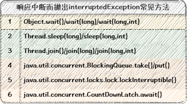
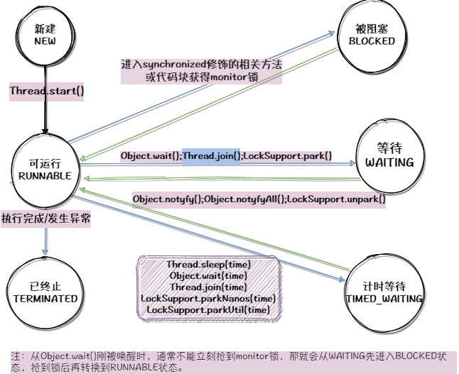
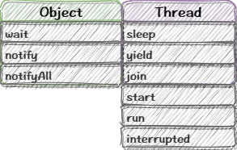
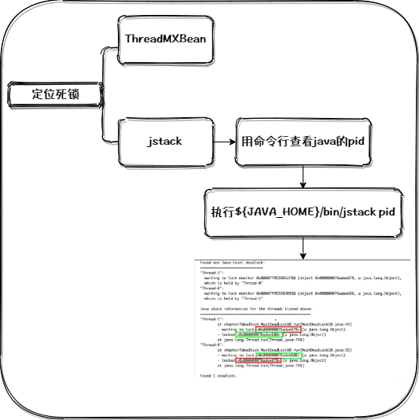

#### 1.`线程属性`

线程ID，线程名字，守护线程、线程优先级、线程状态

#### 2.`实现多线程的方式`

* Oracle官网认证的是两种：一种是实现Runnable接口，重写run方法，调用start()方法;方法二是继承Thread类，重写run方法，调用start()方法。

* 从代码架构角度，具体的任务和创建运行的线程的机制解耦比较好；从扩展的角度，继承Thread类就无法再继承别的类，限制了可扩展性；从性能的角度，继承Thread类的方式每新建一个新的任务，只能新建一个独立的线程，创建和销毁线程都需要损耗，而使用Runnable和线程池，可以减小这种损耗。所以实现Runnable接口的方案是更优的。

* 这两种方法本质上是一样的，最终都调用了start()方法，最主要的区别在于run()方法的来源不同。方法一是最终调用target.run();方法二是run()方法整个被重写。

```java
@Override
public void run() {
    if (target != null) {
        target.run();
    }
}
```

* 其他方案如线程池创建线程，通过`Callable`和`FutureTask`创建线程，匿名内部类创建线程等方式，本质上也都是灵活运用了上面两种方式。(“无返回值是实现runnable接口，有返回值是实现callable接口”)


#### 3. `正确启动线程`

> start()才是真正启动一个线程，如果直接调用run()方法，那么run()只相当于一个普通的方法而已，和线程生命周期没有关系了。

<p align='middle'></p>

检查线程状态，只有NEW状态下的线程才能继续，否则会抛出IllegalThreadStateException。


#### 4. `正确停止线程`

正确的做法是用interrupt来请求线程停止，而不是强制，这样可以避免线程业务数据的戛然而止，保证安全。开发过程中，优先选择传递中断，不能传递时，选择恢复中断，不能屏蔽或吞掉中断。不应使用stop/suspend,会造成死锁。

<p align='middle'></p>


#### 5. `线程的生命周期和状态`

<p align='middle'></p>


#### 6.`Thread与Object类中与线程相关的方法`

<p align='middle'></p>


* wait,notify,notifyAll必须在同步代码块中使用 

* 调用Thread类的wait方法会导致线程退出的时候自动notify()，对自设计的唤醒流程产生干扰，不推荐调用Thread类的wait()

* wait()和sleep()区别

* 调用Thread.join()，线程处于WAITING状态

* sleep期间线程调度器不会去调度该线程，而yield方法只是让线程释放出自己的CPU时间片，线程依然处于就绪状态，随时可以被再次调度。

* 守护线程不影响JVM退出，普通线程会影响JVM的退出。

* run()方法不能抛出异常，如果运行时发生异常，线程会停止运行，状态编程TEMINATED

* 线程安全问题：运行结果错误，如a++多线程下出现结果小于累加次数；对象发布和初始化的时候的安全问题，如构造函数中运行线程；死锁等活跃性问题；


#### 7. `多线程的上下文切换`

- 上下文是指某一时间点CPU寄存器(CPU register)和程序计数器(PC)的内容
- 上下文切换的过程：记录当前任务的上下文(即寄存器和计数器等所有的状态)；找到新任务的上下文并加载；切换到新任务的程序计数器位置，恢复其任务。
- 不同进程之间的线程上下文切换：进程是由内核来管理和调度的，进程的切换只能发生在内核态。进程的上下文不仅包括了用户空间的资源，也包括内核空间的资源。切换的过程主要包括，接收到切换信号，挂起进程，记录当前进程的虚拟内存，栈等资源存储；将该进程在CPU中的上下文状态存储起来，然后在内存中检索下一个进程的上下文，并将其加载到CPU的寄存器中恢复，刷新新进程的虚拟内存和用户栈，最后跳转到程序计数器所指向的位置，以恢复该进程；
- 进程内部的线程上下文切换：不需要切换进程的用户资源，只需要切换线程私有的数据和寄存器等。

#### 8. `死锁`

- 当两个(或多个)线程(或进程)相互持有对方所需要的资源，又不主动释放，导致所有人都无法继续前进，导致程序陷入无尽的阻塞，这就是死锁。
- 死锁的影响在不同系统中是不一样的，这取决于系统对死锁的处理能力。数据库可以检测并放弃事务；JVM无法自动处理。不一定发生，但遵守墨菲定律。一旦发生，将导致系统崩溃，性能降低。压力测试并不能发现所有潜在的死锁。
- 死锁的四个必要条件：
  - 互斥条件：该资源任意一个时刻只由一个线程占用；
  - 请求与保持条件：一个线程因请求资源而阻塞时，对已获得的资源保持不放；
  - 不剥夺条件：线程已获得的资源在未使用完之前不能被其他线程强制剥夺，只有自己使用完毕后才释放资源。
  - 循环等待条件：若干线程之间形成一种头尾相接的循环等待资源关系。

* 定位死锁

  <p align='middle'></p>

