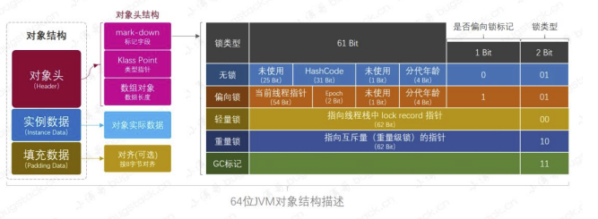

`synchronized`关键字解决的是多个线程之间访问资源的同步性，synchronized关键字可以保证被它修饰的方法或者代码块在任意时刻只能有一个线程执行。

#### 1. `synchronized关键字主要有三种使用方式`

* 修饰实例方法：作用于当前对象实例加锁，进入同步代码前要获得当前对象实例的锁；

  ```
  synchronized void method() {
      //业务代码
  }
  ```

* 修饰静态方法：访问静态synchronized方法占用的锁是当前类的锁，而访问非静态synchronized方法占用的锁是当前实例对象锁。

  ```java
  synchronized static void method() {
      //业务代码
  }
  ```

* 修饰代码块：指定加锁对象，对给定对象/类加锁。synchronized(this|object)表示进入同步代码库前要获得给定对象的锁。synchronized(类.class)表示进入同步代码前要获得当前class的锁。

  ```java
  synchronized(this) {
      //业务代码
  }
  ```

#### 2. `双重校验锁实现对象单例`

```java
public class Singleton {

    private static volatile Singleton6 instance;

    private Singleton(){

    }

    public static Singleton getInstance(){
        if(instance == null){
            synchronized (Singleton6.class){
                if(instance == null){
                    instance = new Singleton6();
                }
            }
        }

        return instance;
    }
}
```

#### 3. `原理`

<p align='middle'>图片来源于网络</p>

* `synchronized`关键字属于JVM层面。Java对象头和Monitor对象是实现`synchronized`的基础。`synchronized`用的锁是存在Java对象头里面的，对象头内保存着无锁状态，偏向锁，轻量级锁，重量级锁等状态和标志位。Monitor来表示一个对象的锁定状态即线程与对象之间锁定关系。
* `synchronized`同步语句块的实现使用的是`monitorenter`和`monitorexit`指令，其中`monitor`指令是在编译后插入到同步的开始位置，`monitorexit`指令则插入到同步的结束位置。
* 当执行`monitorenter`指令时，线程试图获取锁也就是获取对象监视器`monitor`的持有权。如果锁的计数器为0则表示锁可以被获取，获取后将锁计数器设为1也就是加1。对象锁的拥有者才可以指向`monitorexit`指令来释放锁。在执行`monitorexit`指令后，将锁计数为0，表明锁被释放，其他线程可以尝试获取锁。如果获取对象锁失败，那当前线程就要阻塞等待，直到锁被另外一个线程释放为止，以此来实现代码同步。
* `synchronized` 修饰的方法并没有 `monitorenter` 指令和 `monitorexit` 指令，取而代之的是 `ACC_SYNCHRONIZED` 标识，该标识指明了该方法是一个同步方法。
* 这两者本质都是对对象监视器monitor的获取
* 每一个锁关联一个线程持有者和计数器。当某一线程请求成功后，JVM会记下所得持有线程，并将计数器置为1；此时其他线程请求该锁，则必须等待；而持有该锁的线程如果再次请求这个锁，就可以再次拿到这个锁，同时计数器会递增。

#### 4. `synchronized锁优化升级`

* 无锁状态->偏向锁->轻量级锁->重量级锁


* Java早期版本，synchronized属于重量级锁，效率低下，因为监视器锁(monitor)是依赖底层的操作系统的Mutex Lock来实现的，Java的线程是映射到操作系统的原生线程之上的，如果要挂起或者唤醒一个线程，都需要操作系统帮忙完成，而操作系统实现线程之间的切换时需要从用户态转换到内核态，这个状态之间的转换需要相对较长的时间，时间成本相对较高。

* JDK1.6之后对锁的实现引入了大量的优化，如自旋锁，适应性自旋锁，锁消除，锁粗化，偏向锁，轻量级锁等技术来减少锁操作的开销。`synchronized`从无锁升级为偏向锁，再升级为轻量级锁，最后升级为重量级锁，这个过程叫锁的膨胀。偏向锁是加锁和解锁不需要额外消耗，如果线程间存在锁竞争，会带来额外的锁撤销消耗。轻量级锁中竞争的线程不会阻塞，程序的响应速度变快。如果始终得不到锁竞争的线程，使用自旋会消耗CPU。重量级锁中线程竞争不使用自旋，不会消耗CPU，获取不到锁的线程会直接进入阻塞状态，响应时间变长。

* 初次执行`synchronized`代码块时，通过`CAS`修改对象头里的锁标志位，锁对象变成偏向锁。即偏向于第一个获得它的线程。执行完同步代码块后，线程并不会主动释放偏向锁。当第二次到达同步代码块时，线程会通过对象头里的线程ID判断此时持有锁的线程是否是自己，如果是则正常往下执行。由于之前没有释放锁，这里也就不需要重新加锁。如果至始至终使用锁的线程只有一个，很明显偏向锁几乎没有额外开销，性能极高。