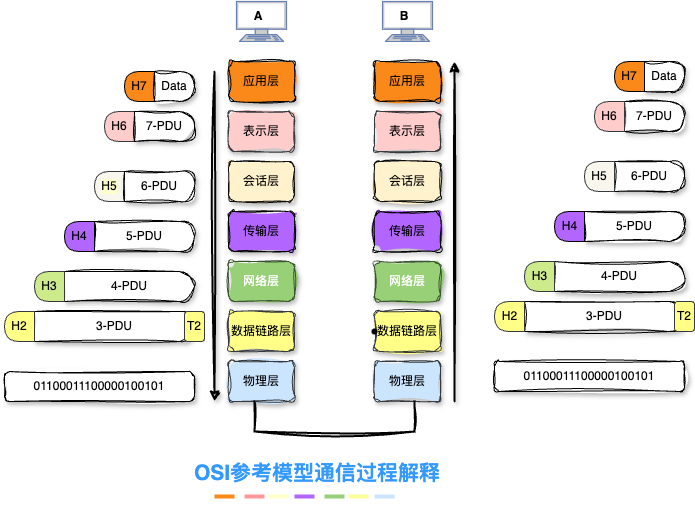
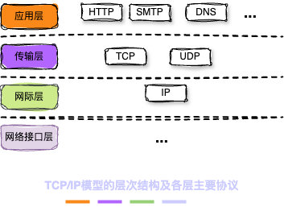
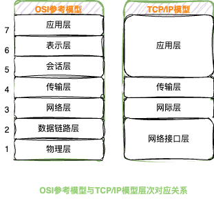
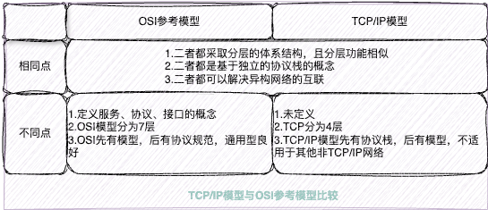

计算机网络(简称网络)，由若干节点和连接这些节点的链路组成。网络中的节点可以是计算机、集线器、交换机或路由器等。

### 1. 组成

  从组成部分看，计算机网络主要由硬件、软件、协议三大部分组成。

* 硬件主要由主机，通信链路，交换设备(如路由器、交换机)和通信处理机(如网卡)等组成。

* 软件主要包括各种实现资源共享的软件和各种工具软件。

* 协议是件算计网络的核心，规定了网络传输数据时所遵循的规范。

### 2. 功能

* 数据通信：实现联网计算机之间各种信息的传输，并联系分散在不同地理位置的计算机，进行统一的分配、控制和管理。如，文件传输、电子邮件等应用。
* 资源共享：软件共享、数据共享、硬件共享。
* 分布式处理：网络中某个计算机负载过重时，将其处理的某些复杂任务分配给网络中的其他计算机系统，提高利用率和吞吐量。
* 增强可靠性

### 3. 分组交换

在网络核心部分起重要作用的是路由器，它对收到的分组进行存储转发来实现分组交换。

### 4. 网络体系结构模型

  计算机网络的各层及其协议的集合称为网络的体系结构。

* 在计算机网络体系结构中，对等层之间传送的数据单位称为该层的协议数据单元(PDU),第n层的PDU记为n-PDU。各层的PDU分为数据和控制信息两部分。
  * 服务数据单元(SDU):为完成用户所要求的功能而传送的数据，第n层的SDU记为n-SDU。
  * 协议控制信息(PCI):控制协议操作的信息，第n层的PCI记为n-PCI。

* 每层的协议数据单元都有一个通俗的名称，如物理层的PDU叫作比特流，数据链路层的PDU叫作帧，网络层的PDU称为分组，传输层的PDU称为报文段。

* 发送数据时，将从第n+1层收到的PDU作为第n层的SDU，加上第n层的PCI，就封装成了第n层的PDU，交给第n-1层后作为SDU发送，接收方接收时做相反的处理。
* 网络协议是控制在对等实体之间进行通信的规则的集合，是水平的。不对等实体之间是没有协议的，如用TCP/IP协议栈通信的两个节点A和节点B，节点A的传输层和节点B的传输层之间存在协议，但节点A的传输层和节点B的网络层之间不存在协议。
* 协议是由语法、语义和同步(或时序)三部分组成
  * 语法：数据与控制信息的格式。如，TCP报文格式是由TCP协议的语法定义的。
  * 语义：即需要发出何种控制信息、完成何种动作及做出何种应答。例如，在建立TCP连接的三次握手时所执行的操作是由TCP协议的语义定义的。
  * 同步(或时序)：执行各种操作的条件、时序关系等，即事件实现顺序的详细说明。如，建立TCP连接的三次握手操作的时序关系就是由TCP协议的同步定义的。

* 接口，同一节点内相邻两层的实体交换信息的逻辑接口称为服务访问点(Service Access Point, SAP)。每层只能为紧邻的层之间定义接口，而不能跨层定义接口。服务是通过SAP提供给上层使用的。

* 服务，是指下层为紧邻的上层提供的功能调用，是垂直的。对等实体在协议的控制下，使得本层能为上层提供服务，但要实现本层的协议，还需要使用下层提供的服务。当上层使用下层提供的服务时，必须与下层交换一些命令，这些命令称为服务源语。

  #### 4.1. 开放系统互连参考模型

  简称OSI参考模型，OSI参考模型有七层，自下而上依次为物理层、数据链路层、网络层、传输层、绘画层、表示层、应用层。

  * 物理层：物理层传输单位是比特，功能是在物理介质上为数据端设备透明地传输原始比特流。物理层主要定义数据终端设备和数据通信设备的物理与逻辑连接方法。

  * 数据链路层：数据链路层传输的单位是帧，它将网络层交来的IP分组封装成帧，并且可靠地传输到相邻节点的网络层。主要作用是加强物理层传输原始比特流的功能，将物理层提供的可能出错的物理连接改造为逻辑上无差错的数据链路，使之对网络层表现为一条无差错的链路。

  * 网络层：网络层传输单位是数据报，它关心的是通信子网的运行控制，主要任务是将网络层的协议数据单元从源节点传输到目的节点，为i分组交换网上的不同主机提供通信服务。无论是哪一层传送的数据单元，都可以笼统地用“分组”来表示。网络层协议主要有IP等。

  * 传输层：功能是为端到端连接提供流量控制、差错控制、服务质量、数据传输管理等服务。网络中参与通信的主机是通过硬件地址或IP地址来标识的；端到端通信是指运行在不同主机内的两个进程之间的通信，一个进程由一个端口来标识，数亿称为端到端通信。传输层主要协议有TCP、UDP。

  * 会话层：允许不同主机上的各个进程之间进行会话，主要为表示层实体或用户进程建立连接，并在连接上有序地传输数据，负责管理主机间的会话进程，包括建立、管理和终止进程间的会话。

  * 表示层：两个通信系统中交换信息的表示方式。不同机器采用的编码和表示方法不同，为了使不同表示方法的数据和信息之间能够互相交换，表示层采用抽象的标准方法定义数据结构，并采用标准的编码形式。此外，也提供数据压缩、加密和解密的功能。

  * 应用层：是OSI参考模型的最高层，是用户与网络的接口。应用层采用不同的应用协议来解决不同类型的应用要求。典型的协议有文件传送的FTP、用于电子邮件的SMTP、用于万维网的HTTP等。

    

  #### 4.2. TCP/IP模型

  TCP/IP模型从低到高依次为网络接口层、网际层、传输层和应用层。

  * 网络接口层：网络接口层的功能类似于OSI参考模型的物理层和数据链路层，主要作用是从主机或节点接收IP分组，并将它们发送到指定的物理网络上。
  * 网际层：是模型的关键部分，它将分组发往任何网络，并为其独立地选择合适的路由，但不保证各个分组有序地到达，各个分组的有序和可靠交付由高层负责。网际层定义了标准的分组格和协议，即IP。当前采用IPv4，下一版本是IPv6。
  * 传输层(应用-应用或者进程-进程)：功能是使得发送端和目的端主机上的对等实体进行会话，主要是用两种协议：传输控制协议和用户数据报协议。
    * 传输控制协议(TCP):它是面向连接的，传输数据之前必须先建立连接，能够提供可靠的交付。数据传输的单位是报文段。
    * 用户数据报协议(UDP):它是无连接的，不保证提供可靠的交付，只提供"尽最大努力交付"。数据传输的单位是用户数据报。典型的高层协议：虚拟终端协议、文件传输协议(FTP)、域名解析服务(DNS)、电子邮件协议(SMTP)和超文本传输协议(HTTP)。

####    4.3. OSI参考模型与TCP/IP模型异同

参考文献

[1]王道论坛. 2025年计算机网络考研复习指导[M]. 北京: 电子工业出版社, 2024

[2]谢希仁. 计算机网络[M]. 第八版. 北京: 电子工业出版社, 2021

