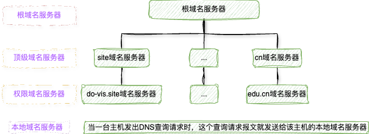
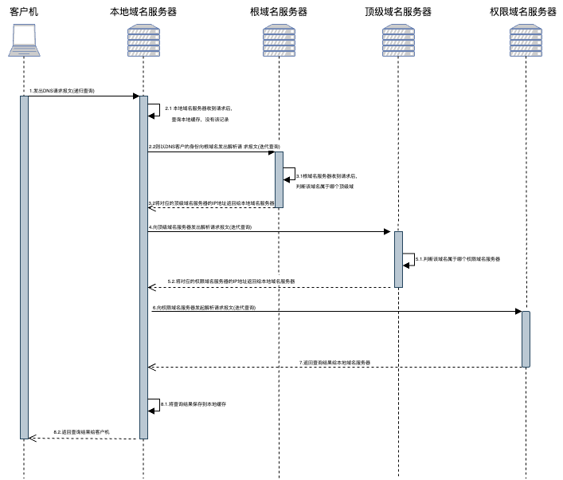

> [!NOTE]
>
> 以下应用层探究是基于TCP/IP结构体系

#### 1. 网络应用模型

* 客户端/服务器模型(C/S)

  * 工作流程

    1)服务器处于接收请求的状态

    2)客户机发出服务请求，并等待接收结果

    3)服务器收到请求后，分析请求，进行必要的处理，得到结果并发送给客户机

  * 主要特征

    1)客户端是服务请求方，服务器是服务提供方

    2)网络中各计算机地位不平等，服务器可以通过用户权限限制管理客户机

    3)可扩展性不佳，受服务器硬件和网络带宽限制，服务器支持的客户机数有限

* P2P模型(本质上仍为客户端/服务器模型，每个节点既作为客户端访问其他节点的资源，又作为服务器提供资源给其他节点访问)

  * 缺点占用内存较多，影响整机速度

#### 2. 域名系统

 域名系统(DNS)是因特网使用的命名系统，用于将具有特定含义的主机名(如www.do-vis.site)转换为便于机器处理的IP地址。DNS系统采用客户端/服务器模型，其协议运行在UDP之上，使用53号端口。从概念的角度，DNS由三部分组成：层次域名空间、域名服务器和解析器。

* 层次域名空间

  因特网采用层次树状结构的命名方法，采用这种方法，任何一个连接到因特网的主机或者路由器都有一个唯一的层次结构名称，即域名。域可以划分子域，子域又可继续划分，这就形成了顶级域、二级域、三级域等。如上，site是顶级域名，do-vis是二级域名，www是三级域名

* 域名服务器

  根域名服务器、顶级域名服务器、权限域名服务器、本地域名服务器

  

  

* 域名解析

  域名解析是指把域名转化为IP地址的过程。当客户端需要域名解析时，通过本机的DNS客户端构造一个DNS请求报文，以UDP数据报方式发往本地域名服务器。

  域名解析有两种方式：递归查询和迭代查询

  (1)主机向本地域名服务器的查询都采用递归查询

  (2)本地域名服务器向其他域名服务器采用递归查询或迭代查询

  若主机所询问的本地域名服务器不知道被查询域名的IP地址，则本地域名服务器就以DNS客户端的省份，向根域名服务器继续发出查询请求报文(即替该主机继续查询)，而不是让主机自己进行下一步的查询。

  递归查询会造成根域名服务器负载过大，本地域名服务器实际中几乎不用该种方式，本地域名服务器向根域名服务器的查询通常是采用迭代查询。
  
  

​        

> [!CAUTION]
>
> 为了提高DNS的查询效率，并减少因特网上的DNS查询报文殊了，在域名服务器中广泛地使用了高速缓存，用来缓存最近查询过的域名的相关映射信息。又因为主机名和IP地址之间的映射不是永久的，所以DNS服务器将在一段时间后丢弃高速缓存中的信息。主机上也有高速缓存，可以在启动时从本地域名服务器下载域名和地址的全部数据库。

#### 3. 文件传输协议

#### 4. 万维网

  万维网(WWW)是一个分布式、联机式的信息存储空间，其内核部分是由三个标准构成。

  1）统一资源定位符(URL):负责标识万维网上的各种文档，并使每个文档在整个万维网的范围内具有唯一的标识符URL。一般形式：<协议>://<主机>:<端口>/<路径>

  2）超文本传输协议(HTTP):一个应用层协议，使用TCP连接进行可靠的传输，HTTP是万维网C/S之间交互必须遵守的协议。

  3）超文本标记语言(HTML)：一种文档结构的标记语言，使用一些约定的标记对页面上的各种信息、格式进行描述。

* 超文本传输协议(HTTP)

  - HTTP定义了浏览器怎样向万维网服务器请求万维网文档，以及服务器怎样把文档传送给浏览器。

    > [!NOTE]
    >
    > 
web访问时的简化流程:浏览器向DNS请求解析请求的IP地址->域名系统DNS解析出服务器的IP地址->浏览器与该服务器建立TCP连接->浏览器发出HTTP请求->服务器通过HTTP相应把文件发送给浏览器->释放TCP连接->浏览器解释文件，并将Web页显示给用户

  - HTTP是无状态的：同一个客户第二次访问同一个服务器上的页面时，服务器的响应与第一次被访问时的相同。

  - HTTP/1.0 非持续连接，即每个页面元素对象的传输都需要单独建立一个TCP连接

  - HTTP/1.1 默认使用持续连接，即指万维网服务器在发送响应后仍然保持这条连接，使同一个客户和该服务器可以继续在这条TCP连接上上传送后续的HTTP请求报文和响应报文。持续连接又分为非流水线和流水线两种工作方式。对于非流水线方式，客户在收到前一个响应后才发出下一个请求，服务器在发送完一个对象后，其TCP连接就处于空闲状态，浪费服务器资源。对于流水线方式，客户可以连续发出对各个对象的请求，服务器就可连续响应这些请求。

  - HTTP的报文结构，报文中每个字段都是一些ASCII码串，并且每个字段的长度都是不确定的。有两类HTTP报文，请求报文与响应报文

    

参考文献

[1]王道论坛. 2025年计算机网络考研复习指导[M]. 北京: 电子工业出版社, 2024

[2]谢希仁. 计算机网络[M]. 第八版. 北京: 电子工业出版社, 2021