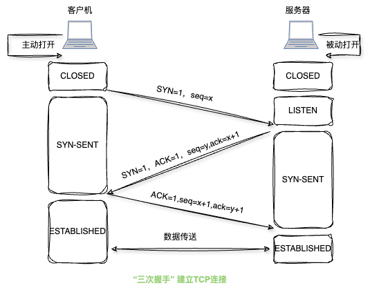
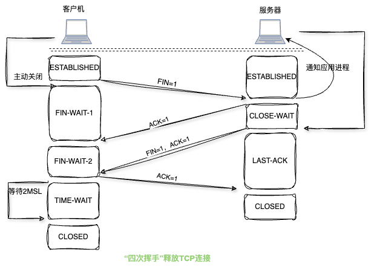

> [!NOTE]
>
> 以下传输层探究是基于TCP/IP体系结构，传输层位于网络层之上、应用层之下，它为运行在不同主机上的进程之间提供通信逻辑。

#### 1.传输层功能

* 应用进程之间的逻辑通信：从传输层来看，通信的真正端点不是主机而是主机中的进程

* 复用和分用

  复用是指发送方不同的应用进程都可以使用同一个传输层协议传送数据

  分用是指接收方的传输层在剥去报文的首部后能够把这些数据正确交付到目的应用进程。

* 检错检测

  传输层要对收到的报文(首部和数据部分)进行差错检测。

  对于TCP协议，若接收方发现报文段出错，则要求发送方重发该报文段。

  对于UDP协议，若接收方发现数据报出错，则直接丢弃。

* 提供面向连接和无连接的传输协议(TCP协议是面向连接的；UDP是面向无连接的)

#### 2.传输层的寻址与端口

#####  2.1.端口作用

  端口可以让应用层的各种进程将其数据通过端口向下交付给传输层，以及让传输层知道应当将其报文段中的数据向上通过端口交付给应用层相应的进程。

#####  2.2.端口号

  端口标识的是主机中的应用进程，传输层使用的是软件端口，这种端口是应用层的各种协议进层与传输实体进行层间交互的一种地址。

#####  2.3.套接字

  套接字(Socket)=(IP地址:端口号)，唯一地标识网络中的一台主机上的一个应用进程。

#### 3. UDP协议

#####  3.1. UDP协议特点

* UDP无须建立连接，也就不会引入建立连接的时延

* 无连接状态

* UDP首部开销小，仅有8B的开销

* UDP没有拥塞控制

* UDP支持一对一、一对多、多对一和多对多的交互通信

  UDP不保证可靠交付，所有维护可靠性的工作克由用户在应用层来完成

  UDP是面向报文的，报文不可分割，是UDP数据报处理的最小单元。

#####  3.2. UDP的首部格式

* UDP数据报包含两部分：首部字段和用户数据字段。UDP首部有8B，由4个字段组成，源端口、目的端口、长度、检验和

#### 4. TCP协议

   TCP是在不可靠的IP层之上实现的可靠的数据传输协议，它主要解决传输的可靠、有序、无丢失和不重复问题。

#####  4.1. TCP协议特点

* TCP是面向连接的传输层协议，TCP连接是一条逻辑连接

* 每一条TCP连接只能有两个端点，每一条TCP连接只能是一对一的。

* TCP提供可靠交付的服务，保证传送的数据无差错、不丢失、不重复且有序

* TCP是提供全双工通信，允许通信双方的应用进程在任何时候都能发送数据，为此TCP连接的两端都设有发送缓存和接收缓存，用来临时存放双向通信的数据

  发送缓存暂时存放的数据：发送应用程序传送给发送方TCP准备发送的数据；TCP已发送但尚未收到确认的数据。

  接收缓存暂时存放的数据：按序到达但尚未被接收应用程序读取的数据；不按序到达的数据。

* TCP是面向字节流的，虽然应用程序和TCP的交互是一次一个数据块，但TCP把应用程序交下来的数据仅视为一连串的无结构的字节流。

  UDP报文长度是应用进程决定，而TCP报文的长度则根据接收方给出的窗口值和当前网络拥塞程度来决定。若应用进程传送到TCP缓存的数据块太长，则TCP就把它划分得短一些再传送；若太短，则TCP也可等到积累足够多的字节后再构成报文段发送出去。

##### 4.2. TCP报文段

  TCP传送的数据单元称为报文段。TCP报文段既可以用来运载数据，又可以用来建立连接、释放连接和应答。一个TCP报文段分为首部和数据两部分。

* TCP首部

  TCP首部前20B是固定的，包括源端口、目的端口、序号、确认号、数据偏移、保留、紧急位URG、确认位ACK、推送位PSH、复位位RST、同步位SYN、终止位FIN、窗口、检验和、紧急指针、选项、填充。

##### 4.3. TCP连接管理

  TCP是面向连接的协议，因此每个TCP连接都有三个阶段：连接建立、数据传送和连接释放。

  TCP连接的建立采用客户/服务器模式

  ###### 4.3.1. TCP连接的建立

  连接建立前，服务器处于LISTEN(收听)状态，等待客户的连接请求，连接建立的过程通常称为“三次握手”

###### 4.3.1. TCP连接释放

#### 4.4. TCP可靠传输

 TCP使用检验、序号、确认和重传等机制来实现可靠性传输

#### 4.5. 为什么不采用“两次握手”建立连接？

主要是为了防止两次握手情况下已失效的连接请求报文段突然又传送到服务器而产生错误

参考文献

[1]王道论坛. 2025年计算机网络考研复习指导[M]. 北京: 电子工业出版社, 2024

[2]谢希仁. 计算机网络[M]. 第八版. 北京: 电子工业出版社, 2021